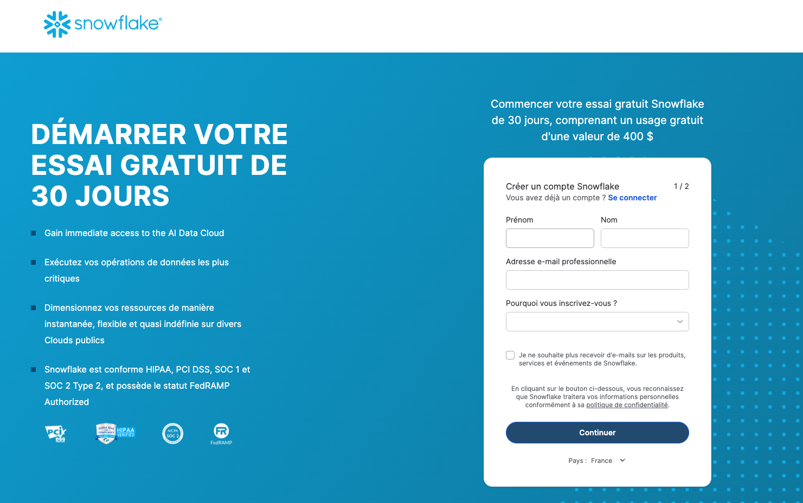
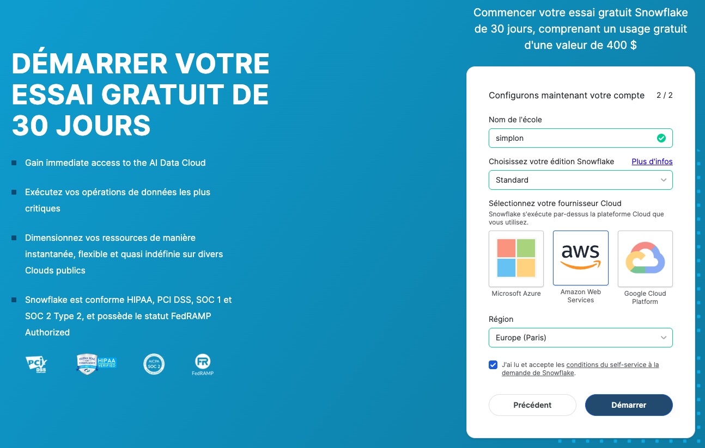
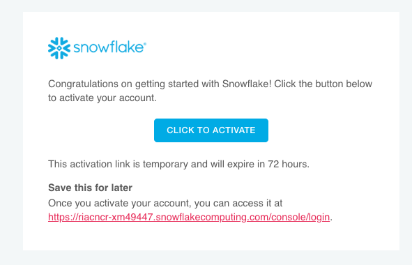
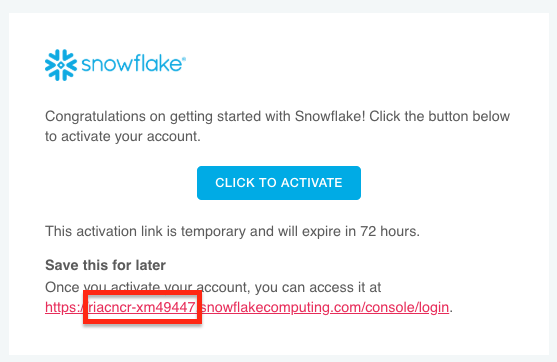

# 1. Création d'un compte Snowflake

[← Retour au sommaire](README.md)

## Vue d'ensemble
Cette section vous guide à travers la création d'un compte Snowflake gratuit avec 30 jours d'essai et 400$ de crédits.

---

## Étape 1 : Accéder au site Snowflake
1. Ouvrez votre navigateur et allez sur : https://signup.snowflake.com
2. Cliquez sur **Start for Free** ou **Essai gratuit**

*Page d'accueil Snowflake avec le bouton Start for Free*

## Étape 2 : Remplir le formulaire d'inscription
Complétez les informations suivantes :
- **First Name** : Votre prénom
- **Last Name** : Votre nom
- **Email** : Votre adresse email professionnelle
- **Company** : Nom de votre entreprise
- **Country** : France
- **Job Title** : Votre fonction

Cochez les cases :
- ✅ J'accepte les conditions d'utilisation
- ✅ J'accepte la politique de confidentialité

## Étape 3 : Choisir votre édition
Snowflake propose plusieurs éditions :
- **Standard** : Fonctionnalités de base, idéal pour débuter
- **Enterprise** : Fonctionnalités avancées avec Time Travel étendu
- **Business Critical** : Sécurité renforcée et haute disponibilité
- **Virtual Private Snowflake** : Isolation complète

Pour débuter, sélectionnez **Standard** (30 jours d'essai gratuit avec 400$ de crédits)

*Page de sélection de l'édition Snowflake*

## Étape 4 : Choisir votre cloud provider et région
1. **Cloud Provider** : Choisissez entre :
   - Amazon Web Services (AWS)
   - Microsoft Azure
   - Google Cloud Platform (GCP)

2. **Région** : Sélectionnez la région la plus proche de vos utilisateurs :
   - Pour la France : **EU-West-1 (Ireland)** pour AWS
   - Pour la France : **West Europe** pour Azure
   - Pour la France : **europe-west1** pour GCP

3. Cliquez sur **Get Started** ou **Démarrer**

## Étape 5 : Vérification de l'email
1. Vérifiez votre boîte email pour le message de confirmation
2. Cliquez sur **Activate Account** dans l'email reçu

*Email d'activation reçu de Snowflake*

## Étape 6 : Créer vos identifiants de connexion
Après avoir cliqué sur le lien d'activation, vous devez créer vos identifiants :

1. **Username** : Créez votre nom d'utilisateur administrateur
2. **Password** : Créez un mot de passe fort
   - Minimum 8 caractères
   - Au moins une majuscule
   - Au moins un chiffre
   - Au moins un caractère spécial

## Étape 7 : Première connexion à Snowflake
1. Vous êtes automatiquement redirigé vers votre console Snowflake
2. L'URL de votre compte sera : `https://[identifiant-unique].snowflakecomputing.com`

*Première connexion réussie à l'interface Snowflake*

## Étape 8 : Configuration initiale du compte
Lors de votre première connexion, Snowflake vous propose :
1. **Quick Tour** : Visite guidée de l'interface (recommandé pour les débutants)
2. **Sample Data** : Charger des données d'exemple
3. **Skip** : Passer directement à l'interface

## ℹ️ Informations importantes sur votre compte d'essai
- **Durée** : 30 jours d'essai gratuit
- **Crédits** : 400$ de crédits inclus
- **Limites** : Pas de limite sur le nombre d'utilisateurs ou de données
- **Support** : Documentation et communauté disponibles
- **Conversion** : Possibilité de convertir en compte payant à tout moment

## 📝 Informations à conserver

Une fois votre compte créé, notez ces informations importantes :
- **Account URL** : `https://[votre-identifiant].snowflakecomputing.com`
- **Username** : Votre nom d'utilisateur administrateur
- **Password** : Votre mot de passe (à garder secret)
- **Account Locator** : Identifiant unique du compte
- **Région** : Région cloud sélectionnée

## ⚠️ Notes importantes

1. **Email de confirmation** : Vérifiez vos spams si vous ne recevez pas l'email
2. **Mot de passe** : Choisissez un mot de passe fort et unique
3. **URL du compte** : Bookmarkez votre URL d'accès
4. **Crédits d'essai** : Surveillez votre consommation dans le dashboard

## ✅ Points de vérification
- [ ] Compte créé avec succès
- [ ] Email d'activation reçu et confirmé
- [ ] Identifiants de connexion créés
- [ ] Première connexion réussie
- [ ] Informations du compte notées en sécurité

---

[Suivant : Connexion à Snowflake →](02-connexion.md)