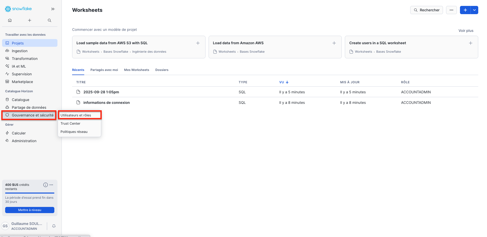
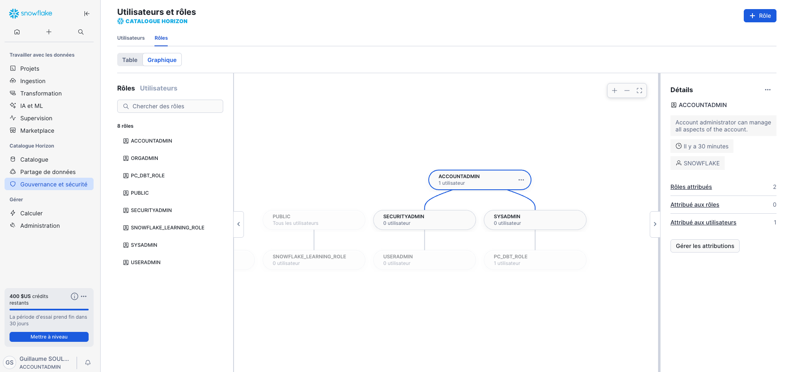

# 3. Création d'un rôle personnalisé

[← Retour au sommaire](README.md) | [← Précédent](02-connexion.md) | [Suivant →](04-creation-warehouse.md)

## Vue d'ensemble
Les rôles dans Snowflake permettent de gérer les accès et privilèges. Nous allons créer un rôle `SALES_ANALYST` pour notre exemple.

---

## Étape 1 : Accéder à la gestion des rôles
1. Cliquez sur **Admin** puis **Account** dans le menu principal
2. Sélectionnez **Users & Roles** dans le sous-menu
3. Cliquez sur l'onglet **Roles**


*Navigation vers la section Roles*

## Étape 2 : Créer un nouveau rôle
1. Cliquez sur **+ Create Role**
2. Remplissez les informations :
   - **Role Name** : `SALES_ANALYST`
   - **Comment** : `Rôle pour l'analyse des données de ventes`
3. Cliquez sur **Create Role**


*Formulaire de création de rôle avec les champs remplis*

## Étape 3 : Configuration des privilèges du rôle
Le rôle `SALES_ANALYST` sera configuré plus tard avec les privilèges appropriés.

## Hiérarchie des rôles Snowflake

### Rôles système par défaut
- **ACCOUNTADMIN** : Administrateur complet du compte
- **SECURITYADMIN** : Gestion de la sécurité et des rôles
- **SYSADMIN** : Création d'objets (databases, warehouses)
- **PUBLIC** : Rôle par défaut pour tous les utilisateurs

### Bonnes pratiques
1. Ne jamais utiliser ACCOUNTADMIN pour les tâches quotidiennes
2. Créer des rôles spécifiques par fonction
3. Suivre le principe du moindre privilège
4. Documenter chaque rôle créé

## Commande SQL équivalente
```sql
-- Créer le rôle via SQL
CREATE ROLE IF NOT EXISTS SALES_ANALYST
    COMMENT = 'Rôle pour l\'analyse des données de ventes';
```

## ✅ Points de vérification
- [ ] Rôle SALES_ANALYST créé
- [ ] Description ajoutée
- [ ] Rôle visible dans la liste

---

[Suivant : Création d'un Data Warehouse →](04-creation-warehouse.md)