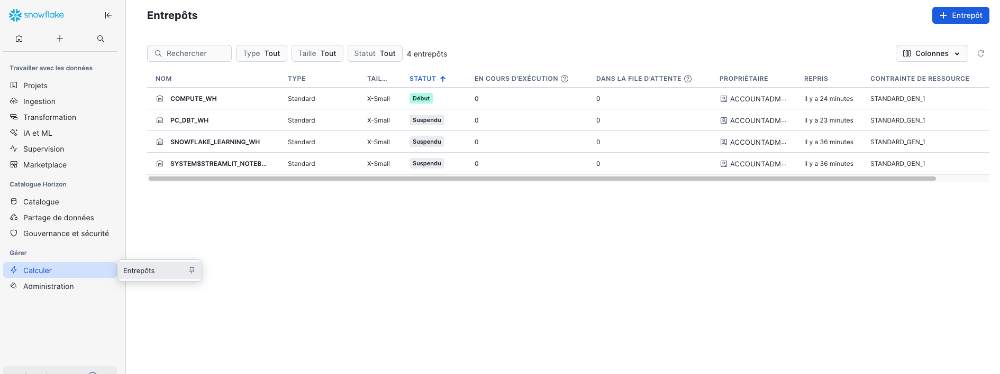
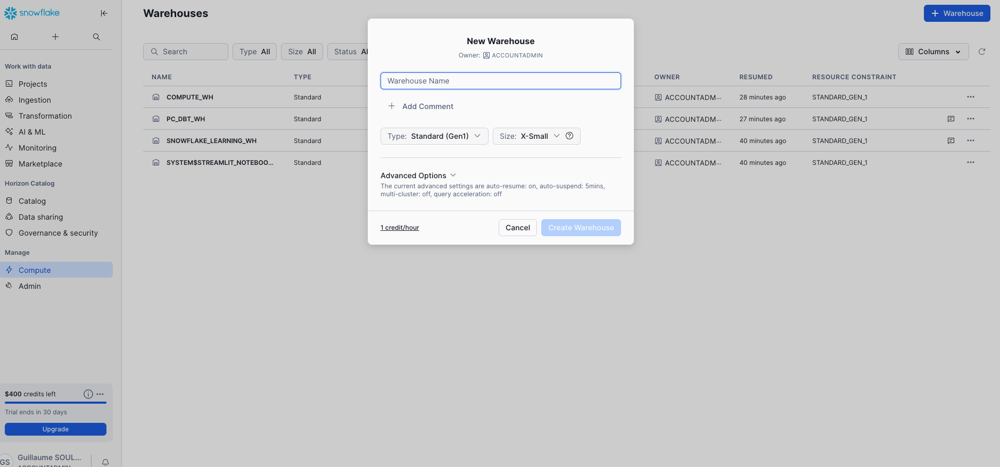
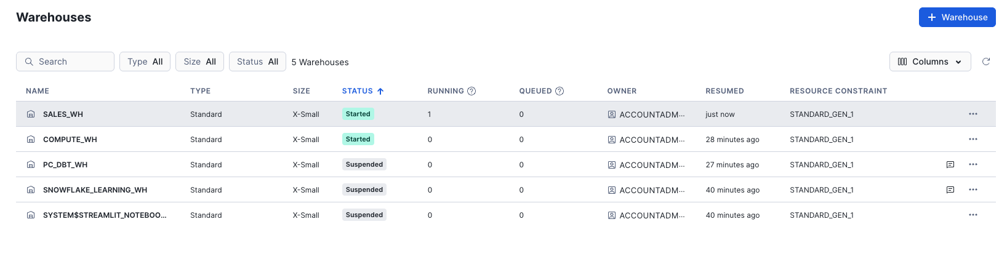

# 4. Création d'un Data Warehouse

[← Retour au sommaire](README.md) | [← Précédent](03-creation-role.md) | [Suivant →](05-creation-database-schema.md)

## Vue d'ensemble
Le warehouse dans Snowflake fournit les ressources de calcul pour exécuter les requêtes. Nous allons créer un warehouse `SALES_WH` optimisé pour les coûts.

---

## Étape 1 : Accéder aux Warehouses
1. Cliquez sur **Compute** puis **Warehouses** dans le menu principal
2. Vous verrez la liste des warehouses existants


*Page de gestion des warehouses*

## Étape 2 : Créer un nouveau warehouse
1. Cliquez sur **+ Create Warehouse**
2. Configurez les paramètres :
   - **Name** : `SALES_WH`
   - **Size** : `X-Small` (pour débuter)
   - **Auto Suspend** : `1 Minutes` (économie de coûts)
   - **Auto Resume** : `Enabled`
   - **Comment** : `Warehouse pour l'analyse des ventes`


*Formulaire de création de warehouse avec les paramètres*

## Étape 3 : Valider la création
1. Cliquez sur **Create Warehouse**
2. Le warehouse apparaît dans la liste avec le statut "Suspended"


*Warehouse créé dans la liste avec son statut*

## Comprendre les tailles de warehouse

| Taille | Crédits/heure | Utilisation recommandée |
|--------|---------------|-------------------------|
| X-Small | 1 | Développement, petites requêtes |
| Small | 2 | Charges légères |
| Medium | 4 | Charges moyennes |
| Large | 8 | Transformations importantes |
| X-Large | 16 | Charges lourdes |
| 2X-Large | 32 | Très grandes charges |
| 3X-Large | 64 | Charges massives |
| 4X-Large | 128 | Charges extrêmes |

## Paramètres d'optimisation

### Auto-suspend
- Réduit les coûts en suspendant le warehouse inactif
- Recommandé : 1-5 minutes pour développement
- Production : 10-15 minutes selon l'usage

### Auto-resume
- Redémarre automatiquement à la réception d'une requête
- Toujours activer sauf cas spécifiques

### Multi-cluster
- Pour les charges concurrentes élevées
- Disponible en Enterprise Edition+

## Commande SQL équivalente
```sql
CREATE WAREHOUSE IF NOT EXISTS SALES_WH
WITH
    WAREHOUSE_SIZE = 'X-SMALL'
    AUTO_SUSPEND = 60
    AUTO_RESUME = TRUE
    INITIALLY_SUSPENDED = TRUE
    COMMENT = 'Warehouse pour l\'analyse des ventes';
```

## Monitoring du warehouse

### Métriques clés à surveiller
- **Crédits consommés** : Coût d'utilisation
- **Queue time** : Temps d'attente des requêtes
- **Execution time** : Temps d'exécution
- **Concurrent queries** : Requêtes simultanées


## 💡 Conseils d'économie
1. Utilisez la plus petite taille suffisante
2. Réduisez l'auto-suspend au minimum
3. Regroupez les charges de travail
4. Utilisez des warehouses dédiés par équipe/usage
5. **Planifiez des suspensions** en dehors des heures de travail

## ✅ Points de vérification
- [ ] Warehouse SALES_WH créé
- [ ] Auto-suspend configuré (1 minute)
- [ ] Auto-resume activé

---

[Suivant : Création d'une base de données et d'un schéma →](05-creation-database-schema.md)