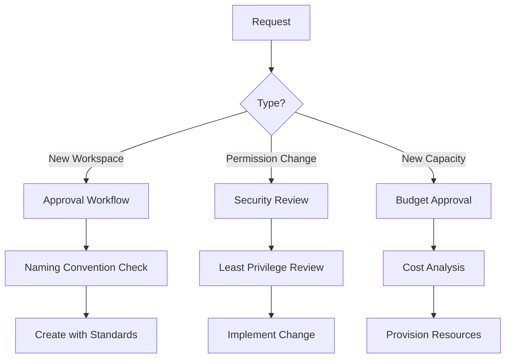

# Administration Best Practices

## Introduction

L'administration efficace de Microsoft Fabric nécessite une approche structurée combinant gouvernance, sécurité, performance et gestion du changement. Ce guide consolide les meilleures pratiques pour maintenir un environnement Fabric sain, sécurisé et performant.

## Gouvernance et Organisation

### Structure des Équipes Admin

```python
# Définition des rôles et responsabilités
fabric_admin_roles = {
    "Fabric Administrator": {
        "responsibilities": [
            "Configuration tenant-wide settings",
            "Gestion des capacités",
            "Monitoring global",
            "Compliance et audit"
        ],
        "required_skills": ["Azure Administration", "Security", "Fabric Architecture"],
        "count_recommended": "1-2 per organization"
    },
    "Workspace Administrator": {
        "responsibilities": [
            "Gestion des workspaces spécifiques",
            "Assignation des permissions",
            "Review des artefacts",
            "Support utilisateurs"
        ],
        "required_skills": ["Fabric Workloads", "Power BI", "Data Engineering"],
        "count_recommended": "1-3 per business domain"
    },
    "Capacity Administrator": {
        "responsibilities": [
            "Monitoring des performances",
            "Right-sizing des SKUs",
            "Gestion du scheduling",
            "Optimisation des coûts"
        ],
        "required_skills": ["Performance Tuning", "Cost Management"],
        "count_recommended": "1 per capacity cluster"
    }
}
```

### Processus de Gouvernance



## Sécurité

### Checklist de Sécurité

```powershell
# Script d'audit de sécurité automatisé
function Invoke-FabricSecurityAudit {
    $auditResults = @{
        Timestamp = Get-Date
        Issues = @()
        Warnings = @()
        Compliant = @()
    }

    # 1. Vérifier les paramètres tenant critiques
    $tenantSettings = Get-PowerBITenantSettings

    if ($tenantSettings.PublishToWebEnabled) {
        $auditResults.Issues += "CRITICAL: Publish to Web is enabled globally"
    } else {
        $auditResults.Compliant += "Publish to Web is disabled"
    }

    # 2. Vérifier les workspaces sans admin
    $workspaces = Get-PowerBIWorkspace -Scope Organization
    foreach ($ws in $workspaces) {
        $admins = $ws.Users | Where-Object {$_.AccessRight -eq "Admin"}
        if ($admins.Count -eq 0) {
            $auditResults.Issues += "Workspace '$($ws.Name)' has no administrators"
        }
    }

    # 3. Vérifier les datasets avec refresh credentials expirées
    $datasets = Get-PowerBIDataset -Scope Organization
    foreach ($ds in $datasets) {
        if ($ds.CredentialsExpired) {
            $auditResults.Warnings += "Dataset '$($ds.Name)' has expired credentials"
        }
    }

    # 4. Vérifier les service principals avec accès admin
    $servicePrincipals = Get-PowerBIServicePrincipalProfiles
    if ($servicePrincipals.Count -gt 10) {
        $auditResults.Warnings += "High number of service principals ($($servicePrincipals.Count))"
    }

    return $auditResults
}

# Exécution hebdomadaire
$audit = Invoke-FabricSecurityAudit
$audit | ConvertTo-Json -Depth 5 | Out-File "security_audit_$(Get-Date -Format 'yyyyMMdd').json"
```

### Principes de Sécurité

1. **Least Privilege** : Accorder uniquement les permissions minimales nécessaires
2. **Defense in Depth** : Multiple couches de sécurité (network, identity, data)
3. **Zero Trust** : Ne jamais faire confiance implicitement, toujours vérifier
4. **Separation of Duties** : Séparer les responsabilités pour éviter les conflits d'intérêts
5. **Regular Rotation** : Rotation des credentials et review des accès

## Performance et Optimisation

### Monitoring Proactif

```sql
-- Dashboard de santé du système
CREATE VIEW admin.system_health_dashboard AS
SELECT
    capacity_name,
    -- Performance
    AVG(cpu_utilization_percent) as avg_cpu,
    MAX(cpu_utilization_percent) as peak_cpu,
    AVG(memory_utilization_percent) as avg_memory,

    -- Fiabilité
    COUNT(CASE WHEN query_status = 'Failed' THEN 1 END) * 100.0 / COUNT(*) as failure_rate,
    COUNT(CASE WHEN is_throttled = 1 THEN 1 END) as throttling_events,

    -- Efficacité
    AVG(query_duration_seconds) as avg_query_time,
    PERCENTILE_CONT(0.95) WITHIN GROUP (ORDER BY query_duration_seconds) as p95_query_time,

    -- Utilisation
    COUNT(DISTINCT user_id) as active_users,
    COUNT(*) as total_operations
FROM fabric_metrics.operations
WHERE operation_date = CURRENT_DATE
GROUP BY capacity_name;

-- Alertes basées sur les seuils
SELECT *
FROM admin.system_health_dashboard
WHERE avg_cpu > 80
   OR failure_rate > 5
   OR throttling_events > 10
   OR p95_query_time > 60;
```

### Optimisation Continue

```python
class PerformanceOptimizer:
    def __init__(self):
        self.recommendations = []

    def analyze_and_recommend(self, metrics):
        """
        Analyse les métriques et génère des recommandations
        """
        # Analyse CPU
        if metrics['avg_cpu'] > 70:
            self.recommendations.append({
                'category': 'CAPACITY',
                'priority': 'HIGH',
                'issue': f"High average CPU: {metrics['avg_cpu']}%",
                'recommendation': 'Consider upgrading to larger SKU or enabling autoscale',
                'estimated_impact': 'Reduced throttling, improved query performance'
            })

        # Analyse des requêtes lentes
        if metrics['p95_query_time'] > 30:
            self.recommendations.append({
                'category': 'QUERY_OPTIMIZATION',
                'priority': 'MEDIUM',
                'issue': f"Slow queries detected: P95 = {metrics['p95_query_time']}s",
                'recommendation': 'Review top 10 slowest queries, add indexes, optimize filters',
                'estimated_impact': 'Better user experience, reduced resource consumption'
            })

        # Analyse du stockage
        if metrics['storage_utilization'] > 80:
            self.recommendations.append({
                'category': 'STORAGE',
                'priority': 'MEDIUM',
                'issue': f"High storage utilization: {metrics['storage_utilization']}%",
                'recommendation': 'Archive old data, implement data lifecycle policies',
                'estimated_impact': 'Cost savings, improved performance'
            })

        # Analyse de l'adoption
        if metrics['active_users'] < metrics['licensed_users'] * 0.3:
            self.recommendations.append({
                'category': 'ADOPTION',
                'priority': 'LOW',
                'issue': 'Low user adoption rate',
                'recommendation': 'Conduct training sessions, improve documentation',
                'estimated_impact': 'Better ROI on Fabric investment'
            })

        return self.recommendations
```

## Change Management

### Processus de Changement

```yaml
# Template de demande de changement
change_request:
  id: "CR-2024-001"
  title: "Upgrade production capacity from F8 to F16"
  requestor: "admin@company.com"
  date_submitted: "2024-01-15"

  classification:
    type: "Infrastructure"
    risk_level: "Medium"
    business_impact: "Low during maintenance window"

  justification:
    current_state: "F8 capacity showing 85% average utilization"
    target_state: "F16 capacity with better headroom"
    business_benefit: "Improved performance, reduced throttling"

  implementation_plan:
    pre_change:
      - "Notify users of maintenance window"
      - "Backup all workspace configurations"
      - "Document current performance baselines"

    change_steps:
      - "Scale capacity to F16 via Azure Portal"
      - "Monitor for errors during scaling"
      - "Validate all workspaces remain assigned"
      - "Run performance validation tests"

    post_change:
      - "Compare performance metrics"
      - "Confirm no user impact"
      - "Update documentation"
      - "Close change request"

    rollback_plan:
      - "Scale back to F8 if issues detected"
      - "Restore configurations from backup"
      - "Notify stakeholders"

  approvals:
    - role: "Technical Lead"
      status: "Approved"
      date: "2024-01-16"
    - role: "Finance"
      status: "Approved"
      date: "2024-01-16"

  scheduled_date: "2024-01-20 02:00 UTC"
  estimated_duration: "1 hour"
```

## Documentation et Knowledge Management

### Documentation Essentielle

1. **Architecture Documentation**
   - Diagramme des capacités et workspaces
   - Flux de données entre artefacts
   - Dépendances et intégrations

2. **Runbooks Opérationnels**
   - Procédures de monitoring quotidien
   - Réponse aux incidents
   - Procédures de maintenance

3. **Registre de Configuration**
   - Tenant settings et justifications
   - Paramètres de sécurité
   - Conventions de nommage

4. **Formation et Onboarding**
   - Guide du nouvel administrateur
   - Procédures standard
   - Contacts et escalade

### Template de Runbook

```markdown
# Runbook: Daily Monitoring Checklist

## Objectif
Vérifier quotidiennement la santé de l'environnement Fabric

## Fréquence
Tous les jours ouvrables à 9h00

## Étapes

### 1. Vérification des Capacités (15 min)
- [ ] Ouvrir le Capacity Metrics App
- [ ] Vérifier CPU < 80% sur toutes les capacités
- [ ] Vérifier absence de throttling
- [ ] Vérifier les refreshes programmés ont réussi

### 2. Review des Alertes (10 min)
- [ ] Consulter le dashboard d'alertes
- [ ] Traiter les alertes critiques immédiatement
- [ ] Documenter les actions prises

### 3. Audit de Sécurité (10 min)
- [ ] Vérifier les tentatives de connexion échouées
- [ ] Review des changements de permissions
- [ ] Vérifier aucune anomalie d'export

### 4. Performance Check (10 min)
- [ ] Top 10 requêtes les plus lentes
- [ ] Erreurs de pipeline
- [ ] Latence des gateways

## Escalade
- Alertes critiques -> Slack #fabric-incidents
- Problèmes de capacité -> capacity-admin@company.com
- Incidents de sécurité -> security-team@company.com
```

## Points Clés

- Établir une structure claire des rôles et responsabilités admin
- Automatiser les audits de sécurité et conformité
- Implémenter un monitoring proactif avec alertes
- Suivre un processus formel de change management
- Documenter toutes les configurations et procédures
- Former continuellement l'équipe aux nouvelles fonctionnalités
- Réviser régulièrement les politiques (mensuel/trimestriel)
- Maintenir des relations avec Microsoft support pour les cas critiques
- Utiliser Infrastructure as Code pour la reproductibilité
- Planifier la capacité en anticipant la croissance

---

**Navigation** : [Précédent : Disaster Recovery and Backup](./07-disaster-recovery-backup.md) | [Index](../README.md) | [Module 13 : DevOps CI/CD](../13-DevOps-CI-CD/01-git-integration.md)
