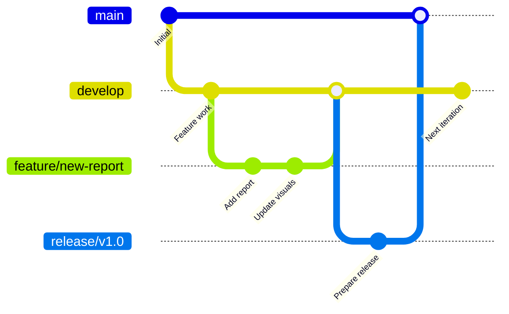

# Git Integration in Microsoft Fabric

## Introduction

L'intégration Git dans Microsoft Fabric permet de gérer les artefacts Fabric comme du code source, offrant le versioning, la collaboration et le déploiement contrôlé. Cette fonctionnalité est essentielle pour implémenter des pratiques DevOps modernes et maintenir la traçabilité des modifications.

## Configuration de l'Intégration Git

### Prérequis

1. Azure DevOps Organization ou GitHub Repository
2. Fabric Workspace avec capacité Premium/Fabric
3. Permissions appropriées (Workspace Admin ou Member)
4. Service Principal ou Personal Access Token

### Connexion à Azure DevOps

```powershell
# Configuration via PowerShell
$workspaceId = "your-workspace-guid"
$gitProviderDetails = @{
    gitProviderType = "AzureDevOps"
    organizationName = "your-org"
    projectName = "your-project"
    repositoryName = "fabric-artifacts"
    branchName = "main"
    directoryName = "/workspace-sales-prod"
}

# API REST pour connecter
$body = $gitProviderDetails | ConvertTo-Json
$uri = "https://api.fabric.microsoft.com/v1/workspaces/$workspaceId/git/connect"

Invoke-RestMethod -Uri $uri -Method Post -Body $body -Headers $headers
```

### Structure du Repository

```
fabric-artifacts/
├── workspace-sales-dev/
│   ├── .pbi/
│   │   └── localSettings.json
│   ├── Sales_Report.Report/
│   │   ├── definition.pbir
│   │   └── report.json
│   ├── Sales_Dataset.SemanticModel/
│   │   ├── definition.pbism
│   │   └── model.bim
│   ├── ETL_Pipeline.DataPipeline/
│   │   └── pipeline.json
│   └── Sales_Lakehouse.Lakehouse/
│       └── lakehouse.json
├── workspace-sales-test/
└── workspace-sales-prod/
```

## Workflows Git

### Branching Strategy



### Git Flow pour Fabric

```yaml
# .azure-pipelines/fabric-gitflow.yml
trigger:
  branches:
    include:
      - main
      - develop
      - feature/*
      - release/*

pool:
  vmImage: 'ubuntu-latest'

stages:
  - stage: Validate
    displayName: 'Validate Changes'
    jobs:
      - job: ValidateArtifacts
        steps:
          - task: PowerShell@2
            displayName: 'Validate JSON syntax'
            inputs:
              targetType: 'inline'
              script: |
                $files = Get-ChildItem -Recurse -Filter "*.json"
                foreach ($file in $files) {
                    try {
                        $null = Get-Content $file.FullName | ConvertFrom-Json
                        Write-Host "Valid: $($file.Name)"
                    } catch {
                        Write-Error "Invalid JSON in $($file.Name)"
                        exit 1
                    }
                }

  - stage: DeployToDev
    displayName: 'Deploy to Development'
    condition: and(succeeded(), eq(variables['Build.SourceBranch'], 'refs/heads/develop'))
    jobs:
      - deployment: DeployDev
        environment: 'fabric-dev'
        strategy:
          runOnce:
            deploy:
              steps:
                - task: PowerShell@2
                  displayName: 'Sync to Dev Workspace'
                  inputs:
                    targetType: 'filePath'
                    filePath: 'scripts/sync-workspace.ps1'
                    arguments: '-WorkspaceId $(DevWorkspaceId) -Direction GitToWorkspace'

  - stage: DeployToTest
    displayName: 'Deploy to Test'
    condition: and(succeeded(), startsWith(variables['Build.SourceBranch'], 'refs/heads/release/'))
    jobs:
      - deployment: DeployTest
        environment: 'fabric-test'
        strategy:
          runOnce:
            deploy:
              steps:
                - task: PowerShell@2
                  displayName: 'Sync to Test Workspace'
                  inputs:
                    targetType: 'filePath'
                    filePath: 'scripts/sync-workspace.ps1'
                    arguments: '-WorkspaceId $(TestWorkspaceId) -Direction GitToWorkspace'
```

## Opérations Git Courantes

### Commit et Sync

```python
import requests
import json

class FabricGitClient:
    def __init__(self, access_token, workspace_id):
        self.token = access_token
        self.workspace_id = workspace_id
        self.base_url = f"https://api.fabric.microsoft.com/v1/workspaces/{workspace_id}/git"
        self.headers = {
            'Authorization': f'Bearer {self.token}',
            'Content-Type': 'application/json'
        }

    def get_status(self):
        """
        Récupère le statut Git du workspace
        """
        response = requests.get(
            f"{self.base_url}/status",
            headers=self.headers
        )
        return response.json()

    def commit_to_git(self, commit_message, items=None):
        """
        Commit les changements du workspace vers Git
        """
        payload = {
            "mode": "All" if items is None else "Selective",
            "commitMessage": commit_message
        }

        if items:
            payload["items"] = items

        response = requests.post(
            f"{self.base_url}/commitToGit",
            headers=self.headers,
            json=payload
        )
        return response.json()

    def update_from_git(self, conflict_resolution="Workspace"):
        """
        Synchronise le workspace depuis Git
        """
        payload = {
            "conflictResolution": {
                "conflictResolutionType": conflict_resolution,
                "conflictResolutionPolicy": "PreferWorkspace" if conflict_resolution == "Workspace" else "PreferRemote"
            }
        }

        response = requests.post(
            f"{self.base_url}/updateFromGit",
            headers=self.headers,
            json=payload
        )
        return response.json()

    def initialize_connection(self, git_provider_details):
        """
        Initialise la connexion Git pour un workspace
        """
        response = requests.post(
            f"{self.base_url}/connect",
            headers=self.headers,
            json=git_provider_details
        )
        return response.json()

# Exemple d'utilisation
# client = FabricGitClient(token, workspace_id)
# status = client.get_status()
# print(f"Git status: {status}")
# client.commit_to_git("Update sales report with Q4 data")
```

### Gestion des Conflits

```powershell
# Script de résolution de conflits automatisée
function Resolve-FabricGitConflict {
    param(
        [string]$WorkspaceId,
        [ValidateSet("PreferWorkspace", "PreferRemote")]
        [string]$ResolutionStrategy = "PreferRemote"
    )

    # Récupérer le statut
    $status = Invoke-RestMethod -Uri "$baseUrl/git/status" -Headers $headers

    if ($status.changes.conflictCount -gt 0) {
        Write-Host "Conflicts detected: $($status.changes.conflictCount)"

        # Lister les conflits
        foreach ($conflict in $status.changes.conflicts) {
            Write-Host "  - $($conflict.itemName): $($conflict.conflictType)"
        }

        # Résolution automatique selon la stratégie
        $resolution = @{
            conflictResolution = @{
                conflictResolutionType = "ByChange"
                conflictResolutionPolicy = $ResolutionStrategy
            }
        }

        # Appliquer la résolution
        Invoke-RestMethod -Uri "$baseUrl/git/updateFromGit" `
            -Method Post -Headers $headers -Body ($resolution | ConvertTo-Json)

        Write-Host "Conflicts resolved using $ResolutionStrategy strategy"
    } else {
        Write-Host "No conflicts detected"
    }
}
```

## Bonnes Pratiques

### Convention de Commit

```markdown
# Format du message de commit
<type>(<scope>): <description>

[optional body]

[optional footer]

# Types
- feat: nouvelle fonctionnalité
- fix: correction de bug
- refactor: refactoring sans changement fonctionnel
- docs: documentation uniquement
- style: formatage, styling
- perf: amélioration de performance
- test: ajout de tests

# Exemples
feat(report): add customer segmentation analysis
fix(pipeline): correct date parsing in ETL
refactor(model): optimize DAX measures for performance
```

### Protection des Branches

```json
{
  "branchPolicies": {
    "main": {
      "requirePullRequest": true,
      "minimumReviewers": 2,
      "requireLinkedWorkItems": true,
      "buildValidation": {
        "enabled": true,
        "pipelineId": "fabric-validation"
      },
      "restrictPushAccess": true
    },
    "develop": {
      "requirePullRequest": true,
      "minimumReviewers": 1,
      "buildValidation": {
        "enabled": true
      }
    }
  }
}
```

## Limitations et Considérations

### Artefacts Supportés

| Artefact Type | Git Support | Notes |
|---------------|-------------|-------|
| Reports | Oui | PBIR/PBIX format |
| Semantic Models | Oui | TMDL format |
| Notebooks | Oui | .py/.ipynb |
| Pipelines | Oui | JSON definition |
| Lakehouses | Partiel | Metadata only |
| Warehouses | Partiel | Schema scripts |
| Dataflows Gen2 | Oui | JSON/M queries |

### Limitations Actuelles

1. **Data non versionné** : Seuls les métadonnées et définitions sont versionnés
2. **Credentials** : Jamais stockées dans Git (sécurité)
3. **Permissions** : Non versionnées, gérées séparément
4. **Taille des repos** : Attention aux limites Git pour gros artefacts

## Points Clés

- Git integration apporte le versioning et la collaboration à Fabric
- Utiliser une stratégie de branching adaptée (Git Flow recommandé)
- Protéger les branches critiques avec des politiques de PR
- Automatiser la validation avec des pipelines CI/CD
- Gérer les conflits avec des stratégies prédéfinies
- Documenter les conventions de commit et de nommage
- Attention aux limitations : data et credentials non versionnés
- Tester régulièrement les workflows Git dans des environnements de dev

---

**Navigation** : [Module 12](../12-Administration-Monitoring/08-admin-best-practices.md) | [Index](../README.md) | [Suivant : Deployment Pipelines](./02-deployment-pipelines.md)
