# Guide Complet : Déploiement Prometheus sur GCP avec Docker Compose

## Introduction

Ce guide vous explique comment déployer Prometheus avec Docker Compose sur une VM Google Cloud Platform en utilisant exclusivement l'interface web de la console GCP.

## Prérequis

- Compte Google Cloud Platform actif
- Projet GCP créé
- Accès à la console GCP : [console.cloud.google.com](https://console.cloud.google.com)

---

## 1. Création d'un bucket Cloud Storage pour les fichiers Prometheus

### Étape 1.1 : Accéder à Cloud Storage

1. Dans le menu de navigation hamburger (☰), cliquez sur **Cloud Storage** > **Buckets**

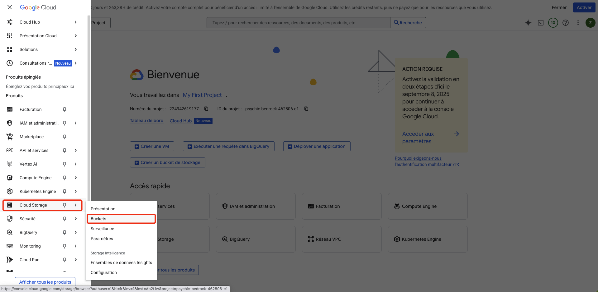

2. Cliquez sur **CRÉER UN BUCKET**

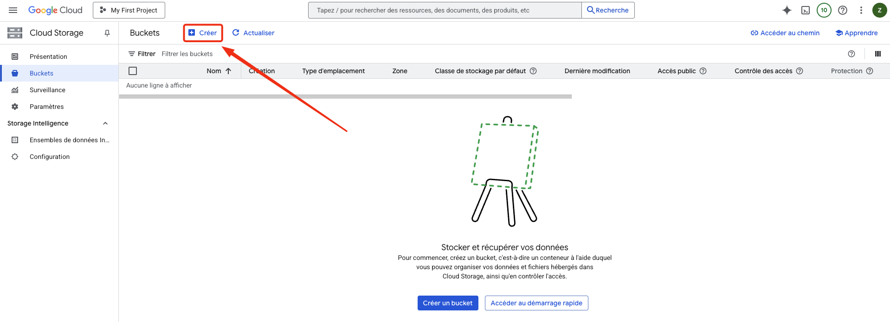

### Étape 1.2 : Configuration du bucket

**Nom du bucket :** `prometheus-config-[VOTRE-PROJECT-ID]` (remplacez par votre ID de projet)

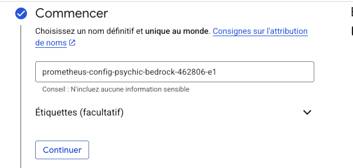

**Type d'emplacement :** `Région`

**Emplacement :** `europe-west9` (Paris)

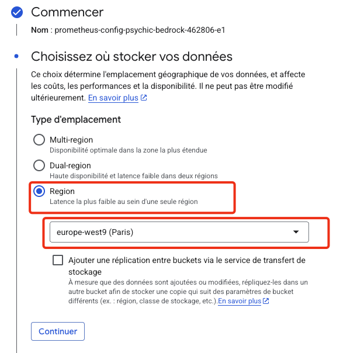

**Classe de stockage par défaut :** `Standard`

**Contrôle d'accès :** `Contrôle d'accès uniforme`

**Protection :** Laissez les options par défaut

3. Cliquez sur **CRÉER**

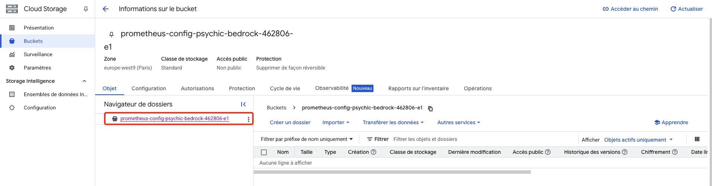

### Étape 1.3 : Upload des fichiers de configuration

1. Cliquez sur le nom de votre bucket pour l'ouvrir.
2. Cliquez ensuite sur **IMPORTER UN DOSSIER**.
3. Sélectionnez le dossier `prometheus` qui contient vos fichiers `docker-compose.yml` et `prometheus.yml`.

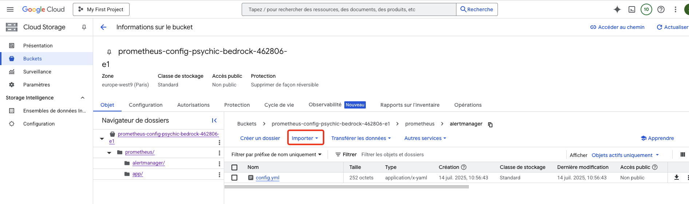

### Étape 1.4 : Configuration des permissions du bucket

1. Cliquez sur l'onglet **AUTORISATIONS** de votre bucket
2. Cliquez sur **ACCORDER L'ACCÈS**

**🔴 SCREENSHOT NÉCESSAIRE : ONGLET AUTORISATIONS DU BUCKET**

3. Ajoutez ces autorisations :
   - **Nouveaux principaux :** `allUsers`
   - **Rôle :** `Storage Object Viewer`

**🔴 SCREENSHOT NÉCESSAIRE : CONFIGURATION DES AUTORISATIONS PUBLIQUES**

4. Cliquez sur **ENREGISTRER**

---

## 2. Création de la VM via la Console GCP

### Étape 2.1 : Accéder à Compute Engine

1. Connectez-vous à [console.cloud.google.com](https://console.cloud.google.com)
2. Dans le menu de navigation hamburger (☰), cliquez sur **Compute Engine** > **Instances de VM**

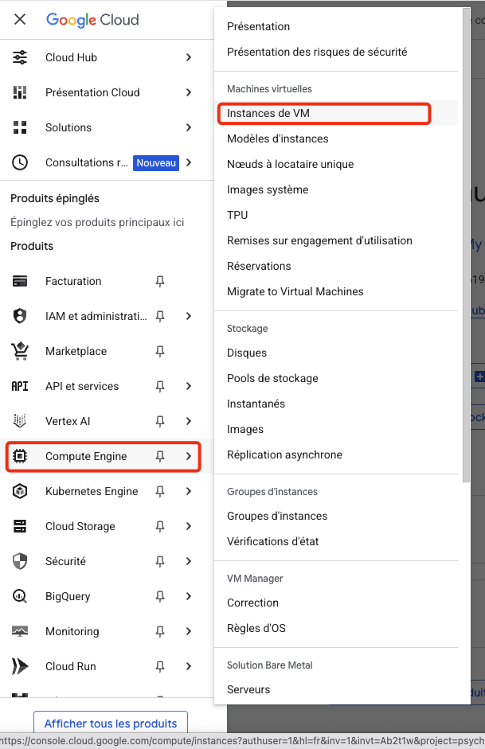

3. Cliquez sur le bouton **CRÉER UNE INSTANCE**

### Étape 2.2 : Configuration de base de l'instance

Dans le formulaire de création :

**Nom de l'instance :** `vm-webserver`

**Région et zone :**
- **Région :** `europe-west9` (Paris)
- **Zone :** `europe-west9-a`


**Configuration de la machine :**
- **Série :** `N2`
- **Type de machine :** `n2-standard-2` (2 vCPU, 8 Go de mémoire)

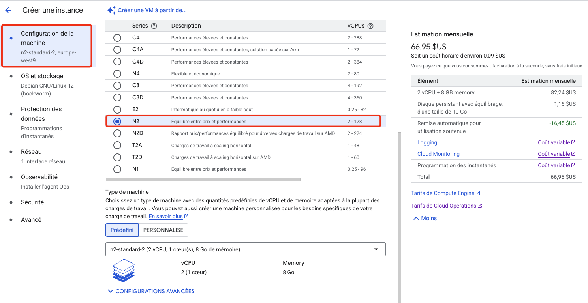

### Étape 2.3 : Configuration du disque de démarrage

1. Dans la section **Disque de démarrage**, cliquez sur **MODIFIER**

2. Dans la fenêtre qui s'ouvre :
   - **Système d'exploitation :** `Ubuntu`
   - **Version :** `Ubuntu 25.04 minimal`
   - **Type de disque :** `Disque persistant avec équilibrage`
   - **Taille :** `20 Go`

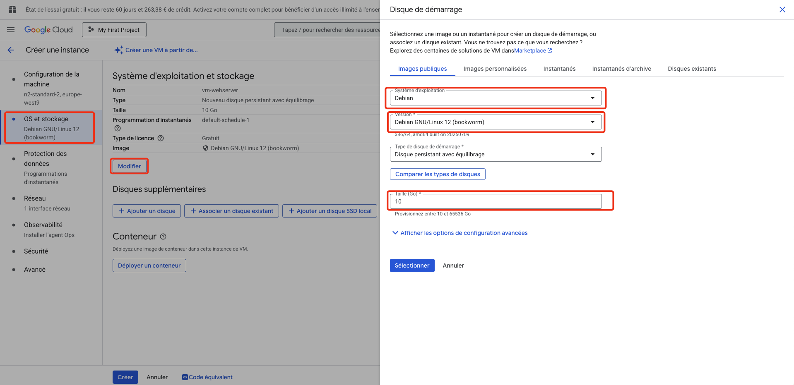

3. Cliquez sur **SÉLECTIONNER**

### Étape 2.4 : Configuration du Réseau

1. Développez la section **Gestion, sécurité, disques, réseau, location unique**.

2. Cliquez sur l'onglet **Réseau**.
3. Dans la section **Pare-feu**, cochez les cases :
   - **Autoriser le trafic HTTP**
   - **Autoriser le trafic HTTPS**
4. Dans **Tags réseau**, ajoutez `prometheus`.

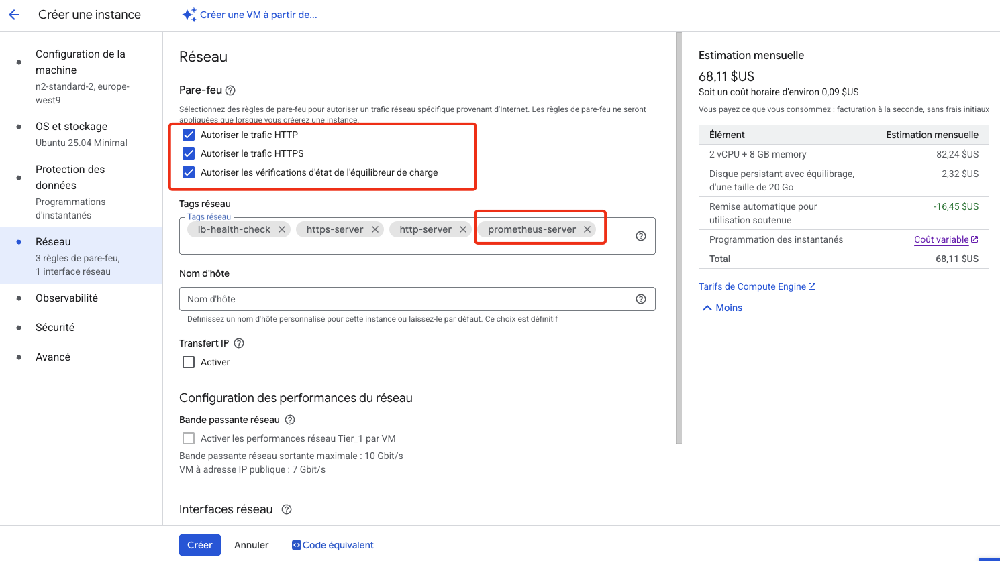

### Étape 2.5 : Script de Démarrage

1. Cliquez sur l'onglet **Avancé**.
2. Dans la zone **Script de démarrage**, collez le script ci-dessous. Il se chargera d'installer Docker, Docker Compose et de récupérer vos fichiers de configuration.

```bash
#!/bin/bash

# Configuration - Récupération automatique du PROJECT_ID
PROJECT_ID=$(curl -s "http://metadata.google.internal/computeMetadata/v1/project/project-id" -H "Metadata-Flavor: Google")

# Mise à jour du système
apt-get update

# Installation de Docker
apt-get install -y apt-transport-https ca-certificates curl gnupg lsb-release
curl -fsSL https://download.docker.com/linux/ubuntu/gpg | gpg --dearmor -o /usr/share/keyrings/docker-archive-keyring.gpg
echo "deb [arch=amd64 signed-by=/usr/share/keyrings/docker-archive-keyring.gpg] https://download.docker.com/linux/ubuntu $(lsb_release -cs) stable" | tee /etc/apt/sources.list.d/docker.list > /dev/null
apt-get update
apt-get install -y docker-ce docker-ce-cli containerd.io docker-compose-plugin

# Démarrer et activer Docker
systemctl start docker
systemctl enable docker

# Installation de Google Cloud SDK
apt-get install -y apt-transport-https ca-certificates gnupg
curl -fsSL https://packages.cloud.google.com/apt/doc/apt-key.gpg | gpg --dearmor -o /usr/share/keyrings/cloud.google.gpg
echo "deb [signed-by=/usr/share/keyrings/cloud.google.gpg] https://packages.cloud.google.com/apt cloud-sdk main" | tee -a /etc/apt/sources.list.d/google-cloud-sdk.list
apt-get update && apt-get install -y google-cloud-cli

# Créer le bucket s'il n'existe pas
gsutil mb gs://prometheus-config-${PROJECT_ID} 2>/dev/null || echo "Bucket existe déjà"

# Créer le dossier prometheus local
mkdir -p /tmp/prometheus-setup

# Téléchargement du dossier prometheus depuis le bucket
cd /home
gsutil -m cp -r gs://prometheus-config-${PROJECT_ID}/prometheus . || echo "Bucket non trouvé - dossier à créer manuellement"

# Ajuster les permissions
chown -R 1000:1000 /home/prometheus

# Démarrer Docker Compose
cd /home/prometheus
echo "Démarrage de Docker Compose"

if [ -f "docker-compose.yml" ]; then
   echo "docker-compose.yml trouvé"
   docker compose up -d
   echo "Statut des conteneurs:"
   docker compose ps
else
   echo "docker-compose.yml non trouvé"
   ls -la /home/prometheus/
fi

echo "Fin du script"
```

**⚠️ IMPORTANT : Remplacez `PROJECT_ID` par l'ID réel de votre projet GCP.**

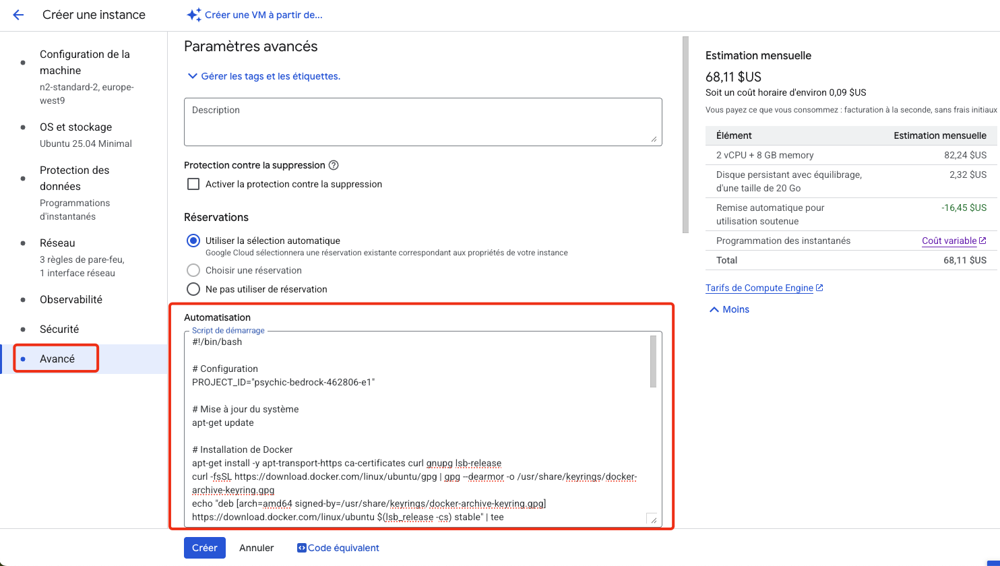

### Étape 2.6 : Finalisation de la création

1. Cliquez sur **CRÉER** en bas de la page

2. Attendez que la VM soit créée (statut avec coche verte)

---

## 3. Configuration du pare-feu

### Étape 3.1 : Accéder aux règles de pare-feu

1. Dans le menu de navigation (☰), allez à **VPC Network** > **Pare-feu**

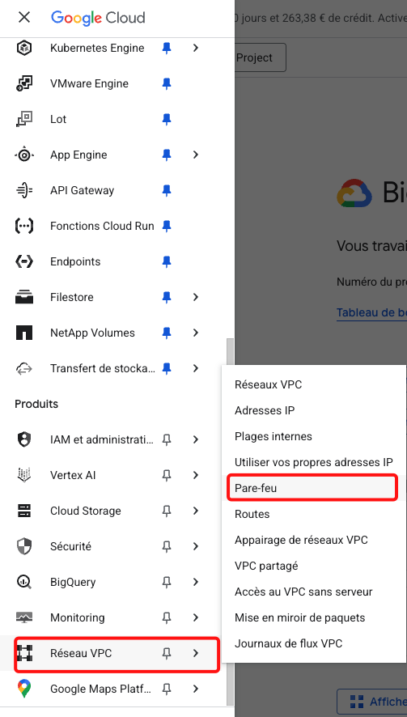

2. Cliquez sur **CRÉER UNE RÈGLE DE PARE-FEU**

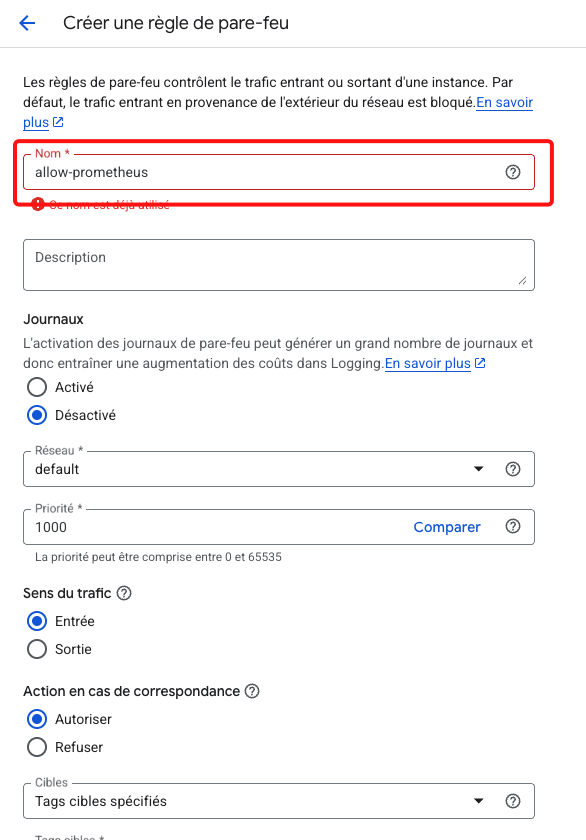

### Étape 3.2 : Configuration de la règle pour Prometheus

Remplissez le formulaire avec :

**Nom :** `allow-prometheus`


**Direction du trafic :** `Entrée`

**Action en cas de correspondance :** `Autoriser`

**Cibles :** `Tags cibles spécifiés`

**Tags cibles :** `prometheus-server` (attention au tag dois etre identique au tag de la VM)

**Filtre source :** `Plages d'adresses IP`

**Plages d'adresses IP sources :** `0.0.0.0/0`

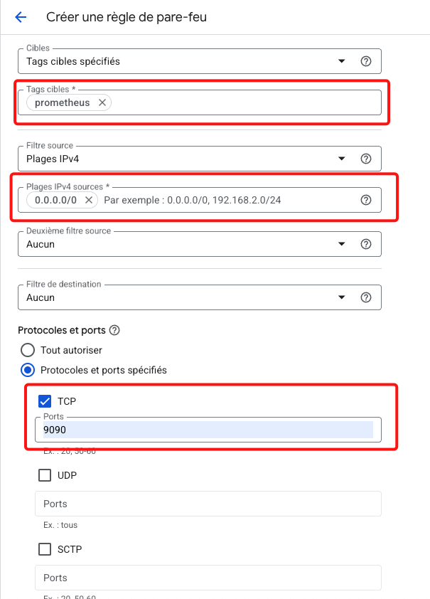


**Protocoles et ports :**
- Cochez **Spécifiés**
- Cochez **TCP**
- **Ports :** `9090`


1. Cliquez sur **CRÉER**


## 4. Connexion SSH et vérification des fichiers

### Étape 4.1 : Connexion SSH

1. Retournez à **Compute Engine** > **Instances de VM**
2. Localisez votre VM `prometheus-vm`
3. Cliquez sur **SSH** dans la colonne "Se connecter"

4. Une nouvelle fenêtre s'ouvre avec un terminal

### Étape 4.2 : Vérification des installations et des fichiers

```bash
# Vérifier Docker
sudo docker --version

# Vérifier docker-compose
docker-compose --version

# Vérifier gsutil
gsutil --version
```

### Étape 4.3 : Vérification des fichiers téléchargés

```bash
# Aller dans le répertoire prometheus
cd /home/prometheus

# Lister les fichiers
ls -la

# Vérifier le contenu des fichiers
cat docker-compose.yml
echo "---"
cat prometheus.yml
```

### Étape 4.4 : Si les fichiers ne sont pas présents (dépannage)

Si les fichiers n'ont pas été téléchargés automatiquement :

```bash
# Télécharger manuellement depuis le bucket
cd /home/prometheus
gsutil cp gs://prometheus-config-[VOTRE-PROJECT-ID]/docker-compose.yml .
gsutil cp gs://prometheus-config-[VOTRE-PROJECT-ID]/prometheus.yml .

# Ajuster les permissions
sudo chown -R $USER:$USER /home/prometheus
```

---

## 5. Démarrage de Prometheus

### Étape 5.1 : Lancement des services

```bash
# Démarrer Prometheus et Node Exporter
sudo docker-compose up -d
```

### Étape 5.2 : Vérification du statut

```bash
# Vérifier que les conteneurs fonctionnent
sudo docker-compose ps
```

### Étape 5.3 : Test local

```bash
# Tester l'accès local à Prometheus
curl http://localhost:9090
```


---

## 6. Récupération de l'IP externe

### Étape 6.1 : Via la console GCP

1. Dans **Compute Engine** > **Instances de VM**
2. Notez l'**IP externe** de votre VM


### Étape 6.2 : Via la ligne de commande

```bash
# Récupérer l'IP externe depuis la VM
curl -H "Metadata-Flavor: Google" http://metadata.google.internal/computeMetadata/v1/instance/network-interfaces/0/access-configs/0/external-ip
```
