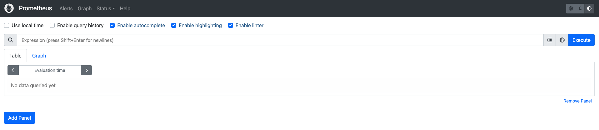
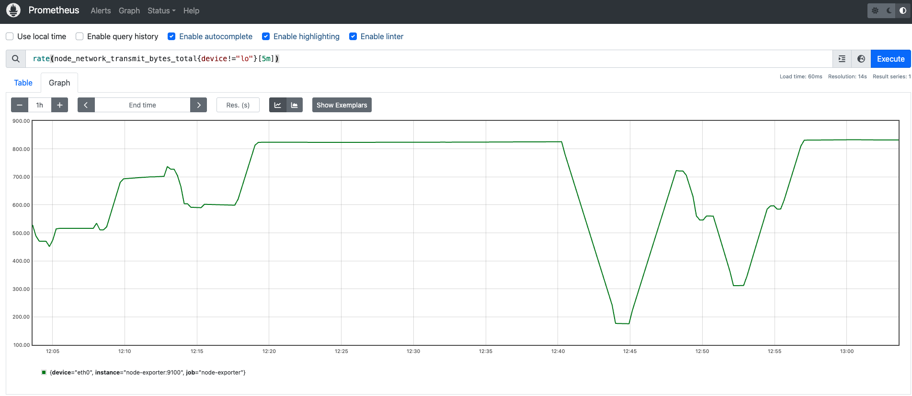
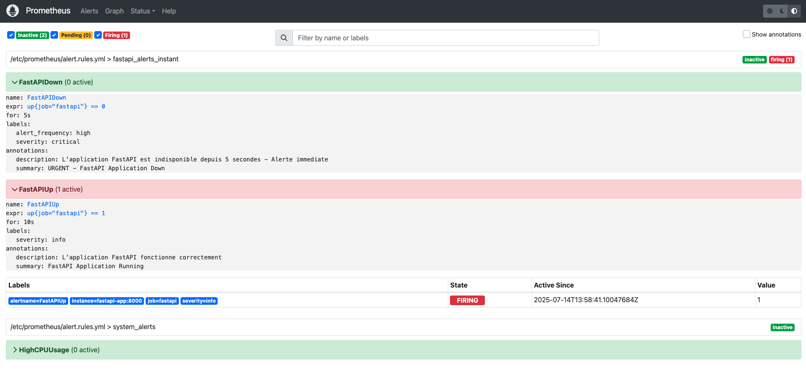

# Guide Prometheus : Monitoring et Alerting avec Node Exporter

## Introduction

Ce guide vous explique comment utiliser l'interface native de Prometheus pour créer des graphiques de monitoring avec Node Exporter et configurer un système d'alerting complet.

## Prérequis

- Prometheus et Node Exporter déployés (voir guide précédent)
- Accès à l'interface web Prometheus sur `http://VOTRE_IP:9090`

---

## 1. Découverte de l'interface Prometheus

### Étape 1.1 : Accès à l'interface

1. Ouvrez votre navigateur et allez à : `http://VOTRE_IP_EXTERNE:9090`



### Étape 1.2 : Navigation dans le menu principal

**Menu principal de Prometheus :**
- **Graph** : Interface de requêtes et graphiques
- **Alerts** : Gestion des alertes
- **Status** : État du système (Targets, Configuration, etc.)
- **Help** : Documentation des fonctions

### Étape 1.3 : Vérification des targets

1. Cliquez sur **Status** > **Targets**
2. Vérifiez que `prometheus` et `node-exporter` sont **UP**


---

## 2. Exploration des métriques Node Exporter

### Étape 2.1 : Découverte des métriques disponibles

1. Cliquez sur **Graph**
2. Dans la barre de recherche, tapez `node_` et utilisez l'autocomplétion


### Étape 2.2 : Métriques essentielles Node Exporter


**Métriques CPU :**
- `node_cpu_seconds_total` : Temps CPU par mode

**Métriques Mémoire :**
- `node_memory_MemTotal_bytes` : Mémoire totale
- `node_memory_MemAvailable_bytes` : Mémoire disponible

**Métriques Disque :**
- `node_filesystem_size_bytes` : Taille des filesystems
- `node_filesystem_free_bytes` : Espace libre
- `node_disk_io_time_seconds_total` : Temps I/O disque

**Métriques Réseau :**
- `node_network_receive_bytes_total` : Octets reçus
- `node_network_transmit_bytes_total` : Octets transmis

---

## 3. Création de graphiques avec PromQL

### Étape 3.1 : Graphique d'utilisation CPU

**Requête PromQL pour CPU en pourcentage :**
```promql
100 - (avg by (instance) (irate(node_cpu_seconds_total{mode="idle"}[5m])) * 100)
```

1. Dans l'interface **Graph**, collez cette requête
2. Cliquez sur **Execute**
3. Basculez sur l'onglet **Graph**


### Étape 3.2 : Graphique d'utilisation mémoire

**Requête PromQL pour mémoire utilisée en pourcentage :**
```promql
((node_memory_MemTotal_bytes - node_memory_MemAvailable_bytes) / node_memory_MemTotal_bytes) * 100
```


### Étape 3.3 : Graphique d'utilisation disque

**Requête PromQL pour espace disque utilisé en pourcentage :**
```promql
((node_filesystem_size_bytes{fstype!="tmpfs"} - node_filesystem_free_bytes{fstype!="tmpfs"}) / node_filesystem_size_bytes{fstype!="tmpfs"}) * 100
```


### Étape 3.4 : Graphique de charge système

**Requête PromQL pour charge système :**
```promql
node_load1
```

### Étape 3.5 : Graphique de trafic réseau

**Requête PromQL pour trafic réseau (bytes/sec) :**
```promql
rate(node_network_receive_bytes_total{device!="lo"}[5m])
```

**Requête pour trafic sortant :**
```promql
rate(node_network_transmit_bytes_total{device!="lo"}[5m])
```



---

## 4. Techniques avancées de visualisation

### Étape 4.1 : Personnalisation des graphiques

**Options de personnalisation disponibles :**
- **Résolution** : Ajuster la précision temporelle
- **Range** : Modifier la période d'affichage (1h, 6h, 24h, etc.)
- **Format** : Table ou Graph


### Étape 4.2 : Utilisation des fonctions PromQL

**Fonction `rate()` pour les compteurs :**
```promql
rate(node_network_receive_bytes_total[5m])
```

**Fonction `increase()` pour voir l'augmentation :**
```promql
increase(node_network_receive_bytes_total[1h])
```

**Fonction `avg_over_time()` pour moyenner :**
```promql
avg_over_time(node_load1[10m])
```

### Étape 4.3 : Regroupement avec `by` et `without`

**Regrouper par instance :**
```promql
avg by (instance) (node_load1)
```

**Somme de tout le trafic réseau :**
```promql
sum(rate(node_network_receive_bytes_total[5m]))
```

---

## 5. Configuration des alertes

### Étape 5.1 : Création du fichier de règles d'alerte

1. Connectez-vous en SSH à votre VM
2. Créez le fichier de règles :

```bash
cd /home/prometheus
nano alert.rules.yml
```

**Contenu du fichier `alert.rules.yml` :**
```yaml
groups:
  - name: fastapi_alerts_instant
    interval: 5s  # ← Evaluation toutes les 5 secondes
    rules:
    - alert: FastAPIDown
      expr: up{job="fastapi"} == 0
      for: 5s  # ← Alerte après seulement 5 secondes
      labels:
        severity: critical
        alert_frequency: "high"
      annotations:
        summary: "URGENT - FastAPI Application Down"
        description: "L'application FastAPI est indisponible depuis 5 secondes - Alerte immediate"

    - alert: FastAPIUp
      expr: up{job="fastapi"} == 1
      for: 10s
      labels:
        severity: info
      annotations:
        summary: "FastAPI Application Running"
        description: "L'application FastAPI fonctionne correctement"

  - name: system_alerts
    interval: 1m
    rules:
    - alert: HighCPUUsage
      expr: rate(process_cpu_seconds_total[1m]) * 100 > 20
      for: 1m
      labels:
        severity: warning
      annotations:
        summary: "CPU Usage High"
        description: "Utilisation CPU elevee"
```

### Étape 5.2 : Modification de la configuration Prometheus

```bash
# Éditer le fichier prometheus.yml
nano prometheus.yml
```

**Ajoutez la section `rule_files` :**
```yaml
global:
  scrape_interval: 15s
  evaluation_interval: 15s

rule_files:
  - "alert.rules.yml"

scrape_configs:
  - job_name: 'prometheus'
    static_configs:
      - targets: ['localhost:9090']

  - job_name: 'node-exporter'
    static_configs:
      - targets: ['node-exporter:9100']
```


---

## 6. Gestion des alertes dans l'interface

### Étape 6.1 : Visualisation des règles

1. Dans Prometheus, allez à **Status** > **Rules**
2. Vérifiez que vos règles sont chargées


### Étape 6.2 : Surveillance des alertes

1. Cliquez sur **Alerts**
2. Observez l'état des alertes (Inactive, Pending, Firing)




### Étape 6.3 : Test des alertes

** Installer stress :**
```bash
# Sur Ubuntu/Debian
sudo apt update && sudo apt install -y stress
```

**Forcer une alerte CPU (pour test) :**
```bash
# Se connecter en SSH et générer de la charge
stress --cpu 4 --timeout 60s
```