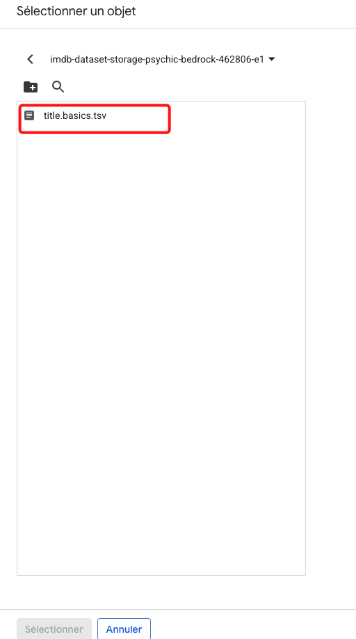

# Formation 4 : Déploiement et Supervision d'une Application Complète avec Django, Uptime Kuma et Prometheus

Bienvenue dans cette formation avancée où nous allons assembler toutes les pièces du puzzle. L'objectif est de construire, déployer et superviser une application web de A à Z.

**Ce que nous allons faire :**
1.  **Créer une base de données PostgreSQL** sur Google Cloud SQL.
2.  **Importer un jeu de données** (films IMDb) depuis un bucket Cloud Storage.
3.  **Développer une application Django** avec un CRUD complet pour gérer ces données.
4.  **Instrumenter l'application** avec des métriques Prometheus.
5.  **Créer une stack Docker Compose** incluant notre application et **Uptime Kuma** pour le monitoring de disponibilité.
6.  **Déployer le tout sur une VM GCP** via un script de démarrage automatisé.
7.  **Intégrer la supervision** de cette nouvelle application dans notre stack Prometheus + Grafana existante.

---

## 1. Préparation de la Base de Données sur GCP

### Étape 1.1 : Créer une instance Cloud SQL (PostgreSQL) - Guide Détaillé

#### 1.1.1 Accès et Création de Base

1.  **Accéder à Cloud SQL :**
    *   Dans la console GCP, utilisez la barre de recherche pour trouver "SQL"
    *   Ou naviguez via le menu : **Bases de données > SQL**
    *   Cliquez sur **CRÉER UNE INSTANCE**

2.  **Sélection du moteur de base de données :**
    *   Choisissez **PostgreSQL** dans la liste des moteurs disponibles
    *   Cliquez sur **Suivant**

#### 1.1.2 Configuration de l'Instance

**Informations de base :**
1.  **ID d'instance :** `postgres-django-monitoring`
    *   Note : Cet ID doit être unique dans votre projet GCP
    *   Il ne peut pas être modifié après création
2.  **Mot de passe :** 
    *   Générez un mot de passe fort (minimum 8 caractères)
    *   **IMPORTANT :** Notez-le précieusement, il sera requis pour la connexion
    *   Exemple : `MonitoringDB2024!`

**Version et Région :**
3.  **Version PostgreSQL :** Sélectionnez `PostgreSQL 15` (dernière version stable)
4.  **Région :** `europe-west9` (Paris) - même région que vos VMs existantes
5.  **Zone :** `europe-west9-a` (ou laissez GCP choisir automatiquement)

#### 1.1.3 Configuration Machine et Stockage

**Type de machine :**
1.  **Preset de configuration :** `Développement` (pour ce cours)
2.  **Type de machine :** 
    *   **vCPUs :** 1 vCPU
    *   **Mémoire :** 3,75 GB
    *   **Type :** `db-n1-standard-1`
3.  **Stockage :**
    *   **Type :** SSD
    *   **Taille :** 10 GB (suffisant pour notre cas d'usage)
    *   **Augmentation automatique :** Activée (recommandé)

#### 1.1.4 Configuration de Connectivité (CRITIQUE)

**Adresse IP :**
1.  **Type d'adresse IP :** Sélectionnez **Adresse IP privée uniquement**
    *   Cette option garantit que la base de données n'est PAS exposée sur Internet
    *   Seules les ressources du même réseau VPC peuvent y accéder

2.  **Réseau :** 
    *   Sélectionnez le réseau `default` (même réseau que vos VMs)
    *   Si vous avez un réseau personnalisé, utilisez celui-ci

3.  **Allocation d'adresse IP privée :**
    *   Si c'est votre première instance Cloud SQL, GCP va vous demander d'allouer une plage d'IP
    *   Cliquez sur **Allouer et connecter** si cette option apparaît
    *   Acceptez la plage par défaut (`10.x.x.x/16`)

#### 1.1.5 Configuration Avancée

**Sauvegarde et Récupération :**
1.  **Sauvegardes automatisées :** Activées
2.  **Heure de sauvegarde :** `02:00` (pendant les heures creuses)
3.  **Point de récupération :** Activé (permet la récupération à un moment précis)
4.  **Rétention :** 7 jours

**Maintenance :**
5.  **Fenêtre de maintenance :** 
    *   **Jour :** Dimanche
    *   **Heure :** `03:00`
    *   **Ordre de mise à jour :** `Plus tard` (évite les interruptions inattendues)


#### 1.1.6 Étiquettes et Finalisation

**Étiquettes (recommandé) :**
1.  Ajoutez des étiquettes pour l'organisation :
    *   `environment` : `development`
    *   `project` : `django-monitoring`
    *   `team` : `ops`

**Révision et Création :**
2.  **Vérifiez le coût estimé** affiché (environ 15-25€/mois pour cette configuration)
3.  Cliquez sur **CRÉER L'INSTANCE**

#### 1.1.7 Post-Création et Vérification

**Attendre la création :**
1.  La création prend généralement 5-10 minutes
2.  Surveillez le statut dans la console GCP

**Noter les informations importantes :**
3.  Une fois créée, notez ces informations cruciales :
    *   **Adresse IP privée :** (ex: `10.34.0.3`)
    *   **Nom de connexion :** `[PROJECT-ID]:[REGION]:[INSTANCE-ID]`
    *   **Port :** `5432` (port standard PostgreSQL)


#### 1.1.8 Configuration de Sécurité (Bonnes Pratiques)

**Utilisateurs et Rôles :**
1.  **Créer un utilisateur dédié pour l'application :**
    *   Allez dans **Cloud SQL > Votre instance > Utilisateurs**
    *   Cliquez sur **Ajouter un compte utilisateur**
    *   **Nom d'utilisateur :** `django_app`
    *   **Mot de passe :** `DjangoApp2024!`
    *   **Type :** `Authentification par base de données`


**Base de données dédiée :**
2.  **Créer une base de données pour l'application :**
    *   Allez dans **Cloud SQL > Votre instance > Bases de données**
    *   Cliquez sur **Créer une base de données**
    *   **Nom :** `django_monitoring_db`
    *   **Jeu de caractères :** `UTF8`
    *   **Classement :** `en_US.UTF8`


#### 1.1.9 Configuration des Autorisations Réseau

**Autoriser l'accès depuis vos VMs :**
1.  Si vous utilisez des adresses IP publiques, ajoutez-les dans **Réseaux autorisés**
2.  Pour les VMs avec IP privées uniquement, assurez-vous qu'elles sont dans le même VPC

**Résumé des informations à conserver :**
```
Instance Cloud SQL PostgreSQL
=============================
ID Instance: postgres-django-monitoring
Adresse IP privée: [NOTER ICI]
Port: 5432
Région: europe-west9

Utilisateur administrateur:
- Nom: postgres
- Mot de passe: [NOTER ICI]

Utilisateur application:
- Nom: django_app  
- Mot de passe: [NOTER ICI]
- Base de données: django_monitoring_db

Chaîne de connexion:
postgresql://django_app:[MOT_DE_PASSE]@[IP_PRIVEE]:5432/django_monitoring_db
```

Ces informations seront utilisées dans la configuration de l'application Django aux étapes suivantes.

**<span style="color: red;"> ATTENTION : LA CREATION DE L'INSTANCE CLOUD SQL POSTGRESQL PEUT PRENDRE PLUSIEURS MINUTES (5-10 MINUTES)</span>**


### Étape 1.2 : Upload du jeu de données CSV (Movies Dataset)

Nous allons utiliser un fichier CSV contenant environ 9000 films populaires avec leurs descriptions et genres. Ce dataset est optimisé pour la démonstration et l'apprentissage.

1.  **Le fichier de données :**
    *   Le fichier `movies.csv` est fourni dans le dossier `data/` du projet
    *   **Taille :** ~9000 films (fichier manageable pour la formation)
    *   **Format :** CSV standard avec headers

2.  **Créez un bucket Cloud Storage :**
    *   Allez dans **Cloud Storage** et créez un nouveau bucket (ex: `movies-dataset-storage-[PROJECT-ID]`)
    *   **Région :** `europe-west9` (même région que votre base de données)
    *   **Classe de stockage :** Standard

3.  **Uploadez le fichier CSV :**
    *   Uploadez le fichier `movies.csv` depuis le dossier `data/` dans votre bucket
    *   **Note :** L'upload sera rapide (fichier de quelques MB)

### Étape 1.3 : Structure des données Movies

Le fichier `movies.csv` contient les colonnes suivantes :

| Colonne | Type | Description |
|---------|------|-------------|
| `id` | int | Identifiant unique du film (TMDB ID) |
| `original_title` | string | Titre original du film |
| `overview` | text | Synopsis détaillé du film |
| `genre_ids` | JSON array | Liste des IDs de genres au format JSON |

**Exemple de données :**
```csv
,id,original_title,overview,genre_ids
0,238,The Godfather,"Spanning the years 1945 to 1955...","[18, 80]"
1,278,The Shawshank Redemption,"Framed in the 1940s for the double murder...","[18, 80]"
```

**Mapping des genres :**
| ID | Genre | ID | Genre |
|----|-------|----|-------|
| 28 | Action | 10402 | Music |
| 12 | Adventure | 9648 | Mystery |
| 16 | Animation | 10749 | Romance |
| 35 | Comedy | 878 | Science Fiction |
| 80 | Crime | 10770 | TV Movie |
| 99 | Documentary | 53 | Thriller |
| 18 | Drama | 10752 | War |
| 10751 | Family | 37 | Western |
| 14 | Fantasy | 36 | History |
| 27 | Horror | | |

### Étape 1.4 : Importation des Données CSV dans PostgreSQL

Il existe plusieurs méthodes pour importer les données CSV dans PostgreSQL. Nous allons voir deux approches : l'import direct et l'import via l'application Django.

#### 1.4.1 Option A : Import Direct via Cloud SQL (Simple et rapide)

**Import via l'interface Cloud SQL :**

1.  **Accéder à l'interface d'import :**
    *   Allez dans **Cloud SQL > Votre instance > IMPORT**
    *   Cliquez sur **IMPORT**


2.  **Configuration de l'import :**
    *   **Fichier source :** Sélectionnez votre bucket et le fichier `movies.csv`

    

    *   **Format :** CSV
    *   **Base de données :** `django_monitoring_db`
    *   **Table :** `movies_temp` (table temporaire)

3.  **Options CSV :**
    *   **Séparateur de champ :** `,` (virgule)
    *   **Caractère d'échappement :** `"`
    *   **Ignorer les lignes :** `1` (header)


**Commande SQL manuelle (Alternative) :**

4.  **Via l'éditeur SQL Cloud SQL :**
    ```sql
    -- Créer la table temporaire
    CREATE TABLE movies_temp (
        row_index INTEGER,
        movie_id INTEGER,
        original_title VARCHAR(500),
        overview TEXT,
        genre_ids TEXT
    );

    -- Importer les données (remplacez par votre bucket)
    COPY movies_temp 
    FROM 'gs://your-bucket-name/movies.csv'
    WITH (FORMAT csv, DELIMITER ',', HEADER true, QUOTE '"');
    

---

## 2. Préparation et Déploiement de l'Application

Maintenant que notre base de données PostgreSQL est prête, nous allons préparer le déploiement de l'application Django complète avec Uptime Kuma.

### Étape 2.1 : Création du Bucket de Déploiement

**Objectif :** Créer un bucket Cloud Storage pour héberger notre code d'application et le rendre accessible à la VM de déploiement.

#### 2.1.1 Création du Bucket

1. **Accéder à Cloud Storage :**
   - Dans la console GCP, cherchez "Cloud Storage" ou utilisez le menu **Stockage > Cloud Storage**
   - Cliquez sur **CRÉER UN BUCKET**

2. **Configuration du bucket :**
   - **Nom :** `django-uptime-kuma-deploy-[PROJECT-ID]`
   - **Type de localisation :** Région
   - **Région :** `europe-west9` (même région que votre base de données)
   - **Classe de stockage :** Standard
   - **Contrôle d'accès :** Uniforme (recommandé)

3. **Permissions :**
   - **Accès public :** Désactivé (sécurité)
   - **Utilisez les permissions par défaut du projet**

#### 2.1.2 Upload du Dossier uptime-kuma

**Préparer les fichiers :**

1. **Vérifier la structure du projet :**
   ```
   uptime-kuma/
   ├── app-django/           # Application Django complète
   ├── data/                 # Fichier movies.csv
   ├── docker-compose.yml    # Configuration des services
   └── .env                  # Variables d'environnement
   ```

2. **Mettre à jour .env avec vos informations :**
   - Éditez le fichier `.env` 
   - Remplacez `your-vm-external-ip` par l'IP de votre future VM
   - Vérifiez l'IP de la base de données (`10.77.128.3`)

**Upload via la console GCP :**

3. **Uploader les fichiers :**
   - Dans votre bucket, cliquez sur **IMPORTER DES FICHIERS** ou **IMPORTER UN DOSSIER**
   - Sélectionnez le dossier `uptime-kuma` complet
   - **Important :** Conservez la structure des dossiers

4. **Vérifier l'upload :**
   - Confirmez que tous les fichiers sont présents
   - Structure attendue dans le bucket :
   ```
   gs://votre-bucket/uptime-kuma/
   ├── app-django/
   ├── data/
   ├── docker-compose.yml
   └── .env
   ```

### Étape 2.2 : Création de la VM de Déploiement

**Objectif :** Créer une VM qui téléchargera automatiquement le code depuis le bucket et lancera l'application.

#### 2.2.1 Configuration de Base de la VM

1. **Accéder à Compute Engine :**
   - Menu **Compute Engine > Instances de VM**
   - Cliquez sur **CRÉER UNE INSTANCE**

2. **Configuration de l'instance :**
   - **Nom :** `vm-django-uptime-kuma`
   - **Région :** `europe-west9` (même région que la base de données)
   - **Zone :** `europe-west9-a` ou `europe-west9-b`

3. **Type de machine :**
   - **Série :** E2
   - **Type :** `e2-medium` (2 vCPU, 4 GB mémoire)
   - **Coût estimé :** ~30€/mois

#### 2.2.2 Configuration du Disque et Réseau

4. **Disque de démarrage :**
   - **Système d'exploitation :** Ubuntu
   - **Version :** Ubuntu 22.04 LTS
   - **Type de disque de démarrage :** SSD persistant standard
   - **Taille :** 20 GB

5. **Pare-feu :**
   - ✅ **Autoriser le trafic HTTP**
   - ✅ **Autoriser le trafic HTTPS**

#### 2.2.3 Script de Démarrage Automatisé

6. **Dans la section "Gestion, sécurité, disques, réseau, location unique" :**
   - Cliquez sur l'onglet **Gestion**
   - Dans **Script de démarrage**, collez le script suivant :

```bash
#!/bin/bash
# Mise à jour et installation de Docker
apt-get update
apt-get install -y docker.io docker-compose
systemctl start docker
systemctl enable docker

# Installation de gcloud CLI
apt-get install -y google-cloud-sdk

# Récupération du projet
cd /home
gsutil -m cp -r gs://django-uptime-kuma-deploy-[PROJECT-ID]/uptime-kuma .

# Démarrage de l'application
cd /home/uptime-kuma
docker-compose up -d
```

**IMPORTANT :** Remplacez `[PROJECT-ID]` par le nom réel de votre bucket !


#### 2.3.2 Test de l'Application

3. **Accès à l'application :**
   - **Django App :** `http://[IP-EXTERNE-VM]:8000`
   - **Uptime Kuma :** `http://[IP-EXTERNE-VM]:3001`


### Étape 4.1 : Configuration de Prometheus

#### 4.1.1 Ajouter la Nouvelle Cible Django

1. **Se connecter à votre VM de monitoring principale :**
   ```bash
   # SSH vers votre VM Prometheus existante
   ```

2. **Modifier la configuration Prometheus :**
   ```bash
   # Éditer le fichier de configuration
   sudo nano /home/prometheus/prometheus.yml
   ```

4. **Ajouter le job Django :**
   ```yaml
   # Dans la section scrape_configs, ajouter :
   scrape_configs:
     # ... vos jobs existants ...
     
     - job_name: 'django-movies-app'
       static_configs:
         - targets: ['[IP-INTERNE-VM-DJANGO]:8000']
       metrics_path: '/metrics'
       scrape_interval: 30s
       scrape_timeout: 10s
       params:
         format: ['prometheus']
   ```

5. **Redémarrer Prometheus :**
   ```bash
   # Si Prometheus est dans Docker
   sudo docker restart prometheus
   
   ```

#### 4.1.2 Vérification de la Configuration

6. **Vérifier les targets dans Prometheus :**
   - Accédez à `http://[IP-PROMETHEUS]:9090/targets`
   - Vérifiez que `django-movies-app` apparaît avec le statut "UP"

7. **Tester les métriques Django :**
   ```bash
   # Dans l'interface Prometheus, tester ces requêtes :
   # - django_http_requests_total
   # - django_db_connections_total
   # - django_http_request_duration_seconds
   ```
### Étape 4.2 : Dashboard Grafana pour Django

#### 4.2.1 Import du Dashboard

1. **Accéder à Grafana :**
   - URL : `http://[IP-GRAFANA]:3000`
   - Connectez-vous avec vos identifiants
  
2. **Import du dashboard :**
   - **Dashboards** → **Import**
   - Copier le code JSON du dashboard django-movies-working-dashboard.json
   - Coller le code JSON dans le champ "Import"

### Étape 4.3 : Ajouter une nouvelle sonde Uptime Kuma

1. **Accéder à Uptime Kuma :**
   - URL : `http://[IP-EXTERNE-VM]:3001`
   - Connectez-vous avec vos identifiants

2. **Ajouter un nouveau moniteur :**
   - Cliquez sur **Ajouter un nouveau moniteur**
   - **Type de moniteur :** HTTP(s)
   - **Nom :** FastAPI App
   - **URL :** http://[IP-EXTERNE-VM-FASTAPI]:8080/docs
   - **Intervalle de surveillance :** 60 secondes

### Étape 4.4 : Ajouter une notification Discord

1. **Créer un webhook Discord :**
   - Dans votre serveur Discord, créez un nouveau salon textuel (ex: #monitoring)
   - Allez dans les **Paramètres du salon** > **Intégrations** > **Webhooks**
   - Cliquez sur **Nouveau webhook**
   - Donnez un nom à votre webhook (ex: Uptime Kuma)
   - Copiez l'URL du webhook

2. **Configurer la notification dans Uptime Kuma :**
   - Allez dans **Paramètres** > **Notifications**
   - Cliquez sur **Ajouter une notification**
   - **Type de notification :** Discord
   - **Nom :** Discord
   - **URL du webhook :** Collez l'URL de votre webhook
   - Cliquez sur **Tester** pour vérifier que la notification fonctionne
   - Cliquez sur **Enregistrer**
   

