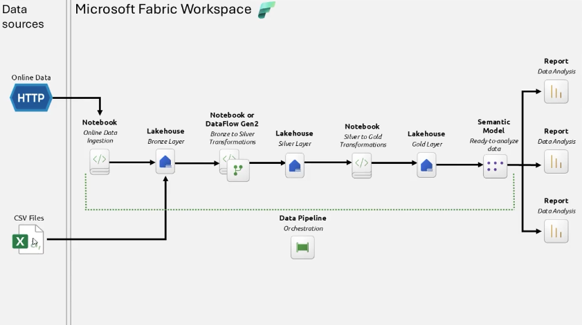
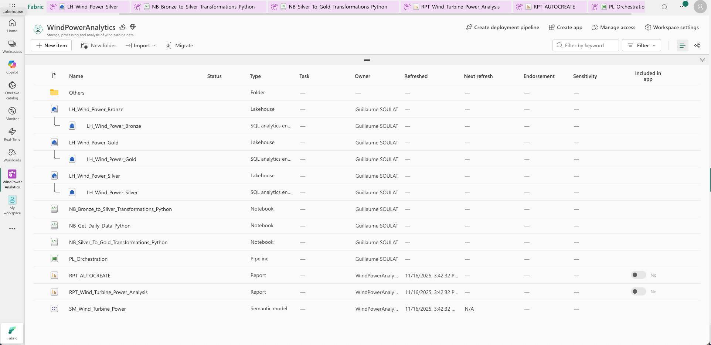

# Brief Projet : Pipeline de données avec Microsoft Fabric
## Analyse de la production d'énergie éolienne

---

## 📋 Informations générales

**Durée estimée :** 2 jours  
**Modalité :** Travail individuel  
**Niveau :** Débutant en Microsoft Fabric avec connaissances SQL de base  
**Plateforme :** Microsoft Fabric (version trial)

---

## 🎯 Objectifs pédagogiques

À l'issue de ce projet, vous serez capable de :

1. **Mettre en place un environnement Microsoft Fabric** complet (Workspace, Lakehouses)
2. **Implémenter une architecture Medallion** (Bronze/Silver/Gold) pour le traitement de données
3. **Développer des notebooks PySpark** pour les transformations de données
4. **Orchestrer un pipeline de données** avec Data Factory
5. **Créer un modèle sémantique dimensionnel** (star schema)
6. **Construire des rapports Power BI** pour visualiser les données transformées
7. **Documenter et versionner votre travail** avec Git/GitHub

---

## 📚 Contexte du projet

Vous êtes data engineer dans une entreprise de production d'énergie renouvelable. Votre mission est de créer une pipeline complète d'analyse de la production d'éoliennes. Les données proviennent de plusieurs turbines éoliennes qui enregistrent leur production en temps réel.

### Données sources

Les données sont disponibles sur un repository GitHub public et contiennent :
- **Date** et **heure** de production
- **Nom de la turbine** et caractéristiques techniques
- **Localisation géographique** (latitude, longitude, région)
- **Conditions de vent** (vitesse, direction)
- **Production d'énergie** (en kWh)
- **Statut opérationnel** et département responsable

**Source des données :** https://github.com/gsoulat/data-training-fabric/tree/main/eolienne

---

## 🏗️ Architecture cible

Vous allez implémenter une **architecture Medallion** en trois couches :

### 🥉 Bronze Layer (Données brutes)
- Ingestion des données CSV depuis GitHub
- Stockage des données brutes sans transformation
- Conservation du format et de la structure d'origine

### 🥈 Silver Layer (Données nettoyées)
- Nettoyage et standardisation des données
- Enrichissement avec des colonnes calculées (jour, mois, année, période de la journée)
- Correction des formats (time avec ":" au lieu de "-")
- Arrondi des valeurs numériques

### 🥇 Gold Layer (Données métier)
- Modèle dimensionnel (star schema) optimisé pour l'analyse
- Tables de dimensions : Date, Time, Turbine, Operational Status
- Table de faits : Production d'énergie
- Prêt pour la consommation par Power BI

*Figure : Architecture complète de la pipeline Medallion*

---

## 📁 Structure du projet

Le projet est organisé en **10 étapes principales**, chacune détaillée dans un fichier séparé :

1. **[Étape 0 : Préparation de l'environnement](Etape_0_Preparation_Environnement.md)**
   - Obtenir un trial Microsoft Fabric
   - Créer le Workspace
   - Préparer Git/GitHub

2. **[Étape 1 : Création des Lakehouses](Etape_1_Creation_Lakehouses.md)**
   - Comprendre le concept de Lakehouse
   - Créer les 3 Lakehouses (Bronze, Silver, Gold)

3. **[Étape 2 : Transformation Bronze → Silver](Etape_2_Transformation_Silver.md)**
   - Comprendre les transformations Silver
   - Créer les notebooks de transformation (PySpark et SQL)
   - Nettoyer et enrichir les données

4. **[Étape 3 : Transformation Silver → Gold](Etape_3_Transformation_Gold.md)**
   - Comprendre le modèle dimensionnel
   - Créer les tables de dimension
   - Créer la table de faits

5. **[Étape 4 : Création du Semantic Model](Etape_4_Semantic_Model.md)**
   - Créer le Semantic Model
   - Définir les relations
   - Créer les mesures DAX
   - Organiser et formater

6. **[Étape 5 : Création des rapports Power BI](Etape_5_Rapports_PowerBI.md)**
   - Créer un rapport auto-généré
   - Créer un rapport personnalisé
   - Ajouter des visuels et interactivité

7. **[Étape 6 : Ingestion des données (Bronze)](Etape_6_Ingestion_Bronze.md)**
   - Créer le notebook d'ingestion
   - Logique d'ingestion incrémentale
   - Initialiser la table Bronze

8. **[Étape 7 : Orchestration avec Pipeline](Etape_7_Orchestration_Pipeline.md)**
   - Créer la Data Pipeline
   - Ajouter les activités Notebook
   - Définir l'ordre d'exécution
   - Planifier l'exécution automatique
---

## 📝 Livrables attendus

À la fin du projet, vous devrez fournir :

### 1. **Repository GitHub** contenant :
   - ✅ Tous les notebooks développés (.ipynb)
   - ✅ Documentation complète du projet (README.md)
   - ✅ Schéma de l'architecture réalisée
   - ✅ Instructions pour reproduire le projet

---

## 🔧 Prérequis techniques

### Connaissances requises
- ✅ Notions de SQL
- ✅ Compréhension des concepts de base de données
- ✅ Familiarité avec les interfaces web
- ✅ Compte GitHub (à créer si nécessaire)

### Accès et outils
- 🌐 Navigateur web moderne (Chrome, Edge, Firefox)
- 📧 Compte Microsoft (personnel ou professionnel)
- 🆓 Trial Microsoft Fabric (instructions dans l'Étape 0)
- 💻 Git installé localement (optionnel mais recommandé)

---

## ⏱️ Planning recommandé (2 jours)

### Jour 1 - Matin (3-4h)
- ✅ Étape 0 : Préparation de l'environnement
- ✅ Étape 1 : Création des Lakehouses
- ✅ Étape 2 : Ingestion des données (Bronze)

### Jour 1 - Après-midi (3-4h)
- ✅ Étape 3 : Transformation Bronze → Silver
- ✅ Étape 4 : Transformation Silver → Gold

### Jour 2 - Matin (3-4h)
- ✅ Étape 5 : Orchestration avec Pipeline
- ✅ Étape 6 : Création du Semantic Model
- ✅ Étape 7 : Création des rapports Power BI

### Jour 2 - Après-midi (3-4h)
- ✅ Étape 8 : Vidéo de démonstration
- ✅ Étape 9 : Documentation finale et GitHub
- ✅ Étape 10 : Validation finale

---

## 🎓 Compétences développées

À l'issue de ce projet, vous aurez développé les compétences suivantes :

- ✅ **Architecture de données** : Maîtrise de l'architecture Medallion (Bronze/Silver/Gold)
- ✅ **Modélisation dimensionnelle** : Création de schémas en étoile (Star Schema)
- ✅ **PySpark** : Transformations distribuées de données
- ✅ **SQL** : Requêtes et transformations déclaratives
- ✅ **Orchestration** : Automatisation de pipelines de données
- ✅ **Power BI** : Visualisation et reporting interactif
- ✅ **DAX** : Mesures et calculs analytiques
- ✅ **Microsoft Fabric** : Utilisation de l'écosystème complet
- ✅ **Delta Lake** : Formats transactionnels pour data lakes
- ✅ **Git/GitHub** : Versioning et collaboration sur le code
- ✅ **Documentation technique** : Communication professionnelle

---

## 🎯 Critères de réussite

### Niveau minimum (Validation du projet)
Pour valider ce projet, vous devez au minimum :

✅ Avoir créé les 3 Lakehouses (Bronze, Silver, Gold)  
✅ Avoir au moins 1 notebook fonctionnel pour chaque couche  
✅ Avoir une Pipeline qui s'exécute sans erreur  
✅ Avoir créé un Semantic Model avec relations  
✅ Avoir au moins 1 rapport Power BI fonctionnel  
✅ Avoir un repository GitHub avec les notebooks  
✅ Avoir une vidéo de démonstration  
✅ Avoir un README.md basique

### Niveau attendu (Projet de qualité)
Pour un projet professionnel :

✅ Tous les critères du niveau minimum  
✅ Pipeline orchestrée avec toutes les étapes  
✅ Modèle dimensionnel complet (4 dimensions + 1 fait)  
✅ 2 rapports Power BI (auto + manuel)  
✅ Documentation technique complète  
✅ Captures d'écran de tous les composants  
✅ Vidéo claire et bien structurée (5-10 min)  
✅ Code commenté et bien organisé  
✅ Commits Git réguliers avec messages clairs

### Niveau excellent (Excellence)
Pour aller au-delà :

✅ Tous les critères du niveau attendu  
✅ Notebooks en PySpark ET SQL  
✅ Mesures DAX avancées (time intelligence, etc.)  
✅ Rapports Power BI avec plusieurs pages et interactivité avancée  
✅ Documentation exhaustive avec diagrammes professionnels  
✅ Guide de troubleshooting détaillé  
✅ Tests de qualité de données implémentés  
✅ Planification automatique de la pipeline  
✅ Vidéo avec montage professionnel  
✅ Repository GitHub avec badges, CONTRIBUTING.md, etc.

---

## 📖 Ressources complémentaires

### Documentation officielle
- [Microsoft Fabric](https://learn.microsoft.com/fabric/)
- [Delta Lake](https://docs.delta.io/)
- [PySpark Documentation](https://spark.apache.org/docs/latest/api/python/)
- [Power BI](https://learn.microsoft.com/power-bi/)
- [DAX](https://learn.microsoft.com/dax/)

### Formations en ligne
- [Microsoft Learn - Fabric Learning Paths](https://learn.microsoft.com/training/browse/?products=fabric)
- [Databricks Academy](https://www.databricks.com/learn/training/home)
- [SQLBI (DAX)](https://www.sqlbi.com/)

### Communautés
- [Microsoft Fabric Community](https://community.fabric.microsoft.com/)
- [Power BI Community](https://community.powerbi.com/)
- [Stack Overflow - microsoft-fabric](https://stackoverflow.com/questions/tagged/microsoft-fabric)

---

## 💡 Conseils avant de commencer

1. **Lisez tous les briefs d'étapes avant de commencer** pour avoir une vue d'ensemble
2. **Suivez les étapes dans l'ordre** - chaque étape dépend des précédentes
3. **Testez fréquemment** - Ne passez à l'étape suivante que si la précédente fonctionne
4. **Documentez au fur et à mesure** - Ne remettez pas la documentation à la fin
5. **Committez régulièrement sur Git** - Faites des commits après chaque étape majeure
6. **N'hésitez pas à demander de l'aide** - Consultez la documentation et les forums
7. **Gérez votre temps** - Utilisez le planning recommandé comme guide
8. **Prenez des captures d'écran immédiatement** - Vous en aurez besoin pour la documentation

---

## 🚀 Prêt à commencer ?

Maintenant que vous avez une vue d'ensemble du projet, passez à la première étape :

➡️ **[Étape 0 : Préparation de l'environnement](Etape_0_Preparation_Environnement.md)**

*Figure : Vue complète du Workspace avec tous les items du projet*

Bonne chance et excellent travail ! 💪

*Document créé le 16 novembre 2025*  
*Version 1.0 - Brief modulaire*  
*Formation Microsoft Fabric - Projet Wind Power Analytics*
