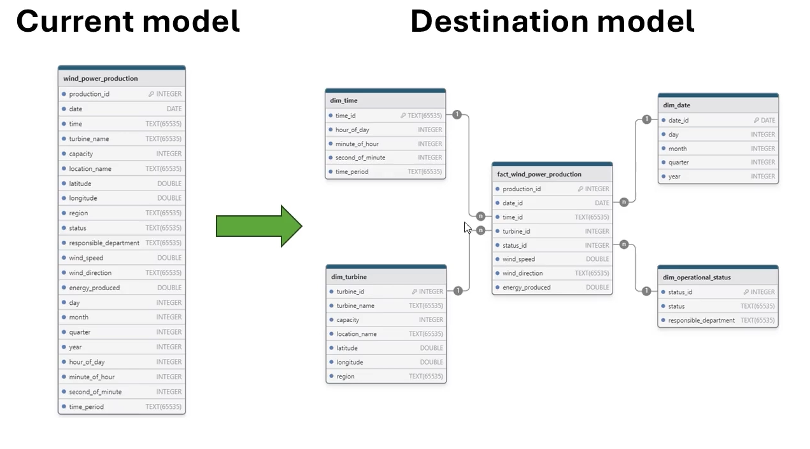

# Étape 4 : Transformation Silver → Gold (Modèle dimensionnel)

**Durée estimée :** 75-90 minutes  
**Difficulté :** ⭐⭐⭐ Avancé

---

## 🎯 Objectifs

- ✅ Comprendre le modèle dimensionnel (Star Schema)
- ✅ Créer les 4 tables de dimension
- ✅ Créer la table de faits
- ✅ Charger toutes les tables dans le Lakehouse Gold
- ✅ Vérifier l'intégrité référentielle
- ✅ Documenter le modèle de données

---

## 📋 Prérequis

- ✅ [Étape 3 : Transformation Silver](Etape_3_Transformation_Silver.md) complétée
- ✅ Données enrichies dans le Lakehouse Silver

---

## 📚 Comprendre le modèle dimensionnel


*Figure : Schéma de transformation Silver → Gold (Current model vs Destination model)*

### Le Star Schema

Le **Star Schema** organise les données en :
- **Tables de dimension** : Décrivent les contextes (qui, quoi, quand, où)
- **Table de faits** : Contient les mesures quantitatives

```
       dim_date          dim_time
          │                 │
          └────┐      ┌────┘
               │      │
          fact_wind_power
               │      │
          ┌────┘      └────┐
          │                │
    dim_turbine    dim_operational_status
```

### Tables à créer

**Dimensions :**
1. **dim_date** : Informations calendaires
2. **dim_time** : Informations horaires
3. **dim_turbine** : Caractéristiques des turbines
4. **dim_operational_status** : Statuts opérationnels

**Fait :**
- **fact_wind_power** : Mesures de production

---

## 💻 Tâche 1 : Créer le notebook Gold

1. **Nouveau Notebook** : `NB_Silver_To_Gold_Transformations_Python`
2. **Attacher** : `LH_Wind_Power_Silver` (lecture) et `LH_Wind_Power_Gold` (écriture)

### Cellule Markdown : Documentation

```markdown
# Transformation Silver → Gold

## 📋 Objectif
Créer un modèle dimensionnel (star schema) optimisé pour l'analyse.

## 🌟 Modèle créé
- **4 dimensions** : Date, Time, Turbine, Operational Status
- **1 fait** : Production éolienne

## 📦 Dépendances
- **Input** : LH_Wind_Power_Silver.dbo.wind_power
- **Output** : LH_Wind_Power_Gold (5 tables)
```

---

## 📝 Tâche 2 : Créer les dimensions

### Cellule 1 : Imports

```python
from pyspark.sql.window import Window
from pyspark.sql.functions import row_number, col
```

### Cellule 2 : Charger depuis Silver

```python
silver_table_path = "abfss://WindPowerAnalytics@onelake.dfs.fabric.microsoft.com/LH_Wind_Power_Silver.Lakehouse/Tables/dbo/wind_power"

df = spark.read.format("delta").load(silver_table_path)

print(f"📊 Données chargées : {df.count()} lignes")
```

### Cellule 3 : dim_date

```python
# Créer dim_date avec valeurs uniques
date_dim = (df
    .select("date", "day", "month", "quarter", "year")
    .distinct()
    .withColumnRenamed("date", "date_id")
)

print(f"📅 dim_date : {date_dim.count()} dates uniques")
date_dim.show(5)
```

### Cellule 4 : dim_time

```python
# Créer dim_time avec valeurs uniques
time_dim = (df
    .select("time", "hour_of_day", "minute_of_hour", "second_of_minute", "time_period")
    .distinct()
    .withColumnRenamed("time", "time_id")
)

print(f"⏰ dim_time : {time_dim.count()} temps uniques")
time_dim.show(5)
```

### Cellule 5 : dim_turbine (avec surrogate key)

```python
# Créer dim_turbine avec ID auto-incrémenté
turbine_dim = (df
    .select("turbine_name", "capacity", "location_name", "latitude", "longitude", "region")
    .distinct()
    .withColumn("turbine_id", 
        row_number().over(
            Window.orderBy("turbine_name", "capacity", "location_name")
        )
    )
)

print(f"🌬️ dim_turbine : {turbine_dim.count()} turbines")
turbine_dim.show()
```

### Cellule 6 : dim_operational_status

```python
# Créer dim_operational_status avec ID
operational_status_dim = (df
    .select("status", "responsible_department")
    .distinct()
    .withColumn("status_id", 
        row_number().over(
            Window.orderBy("status", "responsible_department")
        )
    )
)

print(f"📊 dim_operational_status : {operational_status_dim.count()} statuts")
operational_status_dim.show()
```

---

## 🎯 Tâche 3 : Créer la table de faits

### Cellule 7 : Joindre les dimensions

```python
# Joindre pour récupérer les clés étrangères
df_with_keys = (df
    .join(turbine_dim, 
          ["turbine_name", "capacity", "location_name", "latitude", "longitude", "region"], 
          "left")
    .join(operational_status_dim, 
          ["status", "responsible_department"], 
          "left")
)
```

### Cellule 8 : Créer fact_wind_power

```python
# Table de faits avec uniquement clés et mesures
fact_table = (df_with_keys
    .select(
        "production_id",
        col("date").alias("date_id"),
        col("time").alias("time_id"),
        "turbine_id",
        "status_id",
        "wind_speed",
        "wind_direction",
        "energy_produced"
    )
)

print(f"📈 fact_wind_power : {fact_table.count()} mesures")
fact_table.show(10)
```

---

## 💾 Tâche 4 : Sauvegarder dans Gold

### Cellule 9 : Chemins Gold

```python
base_path = "abfss://WindPowerAnalytics@onelake.dfs.fabric.microsoft.com/LH_Wind_Power_Gold.Lakehouse/Tables/dbo"

gold_date_dim_path = f"{base_path}/dim_date"
gold_time_dim_path = f"{base_path}/dim_time"
gold_turbine_dim_path = f"{base_path}/dim_turbine"
gold_operational_status_dim_path = f"{base_path}/dim_operational_status"
gold_fact_table_path = f"{base_path}/fact_wind_power"
```

### Cellule 10 : Sauvegarde

```python
# Sauvegarder toutes les tables
date_dim.write.format("delta").mode("overwrite").save(gold_date_dim_path)
time_dim.write.format("delta").mode("overwrite").save(gold_time_dim_path)
turbine_dim.write.format("delta").mode("overwrite").save(gold_turbine_dim_path)
operational_status_dim.write.format("delta").mode("overwrite").save(gold_operational_status_dim_path)
fact_table.write.format("delta").mode("overwrite").save(gold_fact_table_path)

print("✅ Toutes les tables créées dans Gold !")
```

---

## ✅ Vérifications

### Cellule 11 : Intégrité référentielle

```python
from pyspark.sql.functions import count

print("=== 🔍 Vérification intégrité référentielle ===\n")

# Vérifier les dates
fact_dates = fact_table.select("date_id").distinct().count()
dim_dates = date_dim.count()
print(f"📅 Dates - Fait: {fact_dates}, Dim: {dim_dates}")

# Vérifier les turbines
fact_turbines = fact_table.select("turbine_id").distinct().count()
dim_turbines = turbine_dim.count()
print(f"🌬️ Turbines - Fait: {fact_turbines}, Dim: {dim_turbines}")

# Vérifier les clés nulles
null_check = fact_table.select([
    count(when(col(c).isNull(), c)).alias(c) 
    for c in ["date_id", "time_id", "turbine_id", "status_id"]
])
print("\n❌ Clés nulles dans fact :")
null_check.show()
```

---

## 📸 Captures d'écran

1. `04_gold_lakehouse_tables.png` - Les 5 tables dans Gold
2. `04_fact_table_preview.png` - Aperçu de fact_wind_power
3. `04_dim_turbine_preview.png` - Aperçu de dim_turbine

---

## 🗂️ Versionner sur GitHub

```bash
git add notebooks/gold/NB_Silver_To_Gold_Transformations_Python.ipynb
git commit -m "feat: Add Gold layer dimensional model"
git push
```

---

## ✅ Vérification

- [ ] 5 tables créées dans Gold
- [ ] Intégrité référentielle validée
- [ ] Pas de clés nulles dans fact
- [ ] Notebook documenté et versionné

---

## 🎯 Prochaine étape

➡️ **[Étape 5 : Orchestration Pipeline](Etape_5_Orchestration_Pipeline.md)**

*Étape 4 complétée ✅ | Temps : ~90 min | Total : ~300 min (~5h)*
