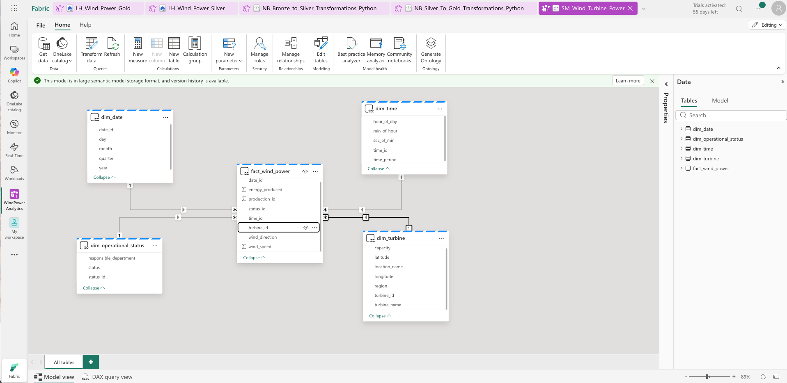

# Étape 6 : Création du Semantic Model

**Durée estimée :** 60-75 minutes  
**Difficulté :** ⭐⭐⭐ Avancé

---

## 🎯 Objectifs

- ✅ Créer le Semantic Model
- ✅ Définir les relations entre tables
- ✅ Créer des mesures DAX
- ✅ Organiser et formater le modèle
- ✅ Créer des hiérarchies

---

## 📋 Prérequis

- ✅ Les 5 tables dans Lakehouse Gold

---

## 💻 Tâche 1 : Créer le Semantic Model

1. **Lakehouse Gold** → "New semantic model"
2. **Sélectionner toutes les tables** :
   - dim_date
   - dim_time
   - dim_turbine
   - dim_operational_status
   - fact_wind_power
3. **Nom** : `SM_Wind_Turbine_Power`
4. **Create**

---

## 🔗 Tâche 2 : Définir les relations

### Relation 1 : fact → dim_date

- **De** : fact_wind_power[date_id]
- **Vers** : dim_date[date_id]
- **Cardinalité** : Many to One (*:1)
- **Direction** : Single

### Relation 2 : fact → dim_time

- **De** : fact_wind_power[time_id]
- **Vers** : dim_time[time_id]
- **Cardinalité** : Many to One (*:1)

### Relation 3 : fact → dim_turbine

- **De** : fact_wind_power[turbine_id]
- **Vers** : dim_turbine[turbine_id]
- **Cardinalité** : Many to One (*:1)

### Relation 4 : fact → dim_operational_status

- **De** : fact_wind_power[status_id]
- **Vers** : dim_operational_status[status_id]
- **Cardinalité** : Many to One (*:1)

---

## 📊 Tâche 3 : Créer des mesures DAX

### Mesure 1 : Production totale

```dax
Total Energy Produced = SUM(fact_wind_power[energy_produced])
```

### Mesure 2 : Vitesse moyenne

```dax
Average Wind Speed = AVERAGE(fact_wind_power[wind_speed])
```

### Mesure 3 : Nombre de mesures

```dax
Count of Measurements = COUNTROWS(fact_wind_power)
```

### Mesure 4 : Production par turbine

```dax
Energy per Turbine = 
DIVIDE(
    [Total Energy Produced],
    DISTINCTCOUNT(fact_wind_power[turbine_id]),
    0
)
```

---

## 🎨 Tâche 4 : Formater

### Formater les mesures

- **Total Energy Produced** :
  - Format : Nombre
  - Décimales : 2
  - Unité : Millions (M)
  - Suffixe : kWh

### Renommer les colonnes

- dim_turbine[turbine_name] → "Turbine"
- dim_turbine[capacity] → "Capacity (MW)"
- fact_wind_power[energy_produced] → "Energy (kWh)"

### Masquer les clés

- Masquer toutes les colonnes _id dans les dimensions
- Masquer les clés étrangères dans fact

---

## 📈 Tâche 5 : Créer une hiérarchie

**Dans dim_date** :
1. Clic droit sur `year` → "Create hierarchy"
2. **Nom** : "Date Hierarchy"
3. **Ajouter** : quarter, month, day

---

## 📸 Captures d'écran


*Figure : Vue Model avec les 4 relations en star schema*


*Figure : Vue d'ensemble du Semantic Model dans Fabric*

---

## ✅ Vérification

- [ ] 4 relations créées
- [ ] 4+ mesures DAX créées
- [ ] Colonnes renommées
- [ ] Clés masquées
- [ ] Hiérarchie créée

---

## 🎯 Prochaine étape

➡️ **[Étape 7 : Rapports Power BI](Etape_7_Rapports_PowerBI.md)**

*Étape 6 complétée ✅ | Temps : ~75 min | Total : ~435 min (~7h15)*
