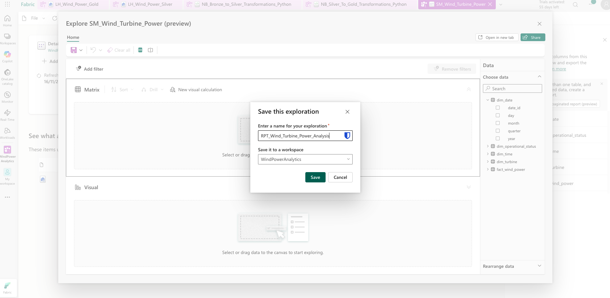
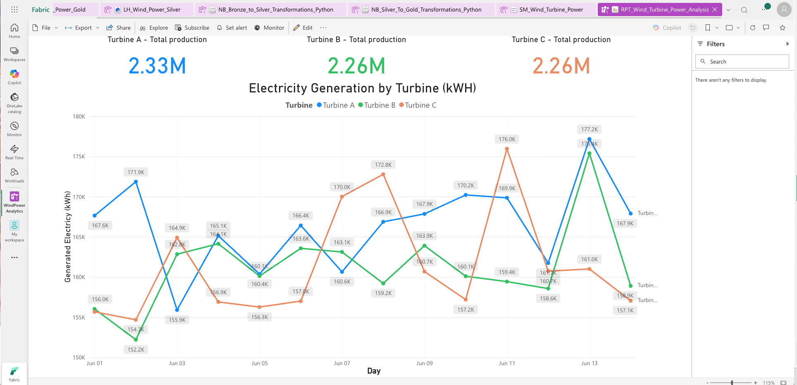
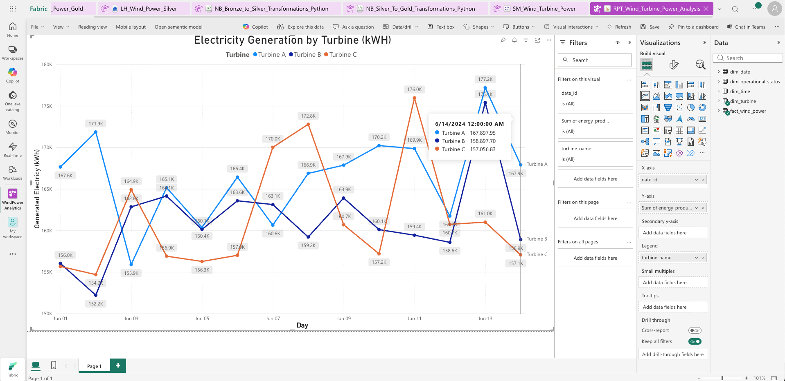
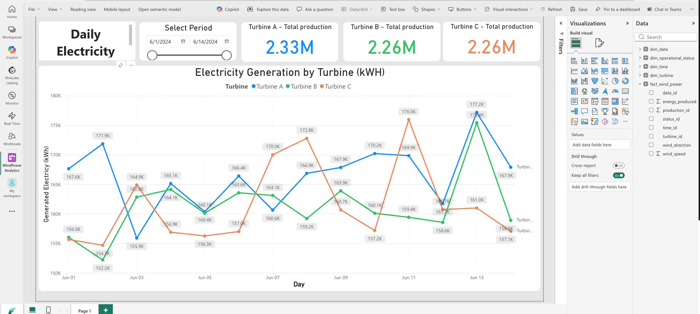
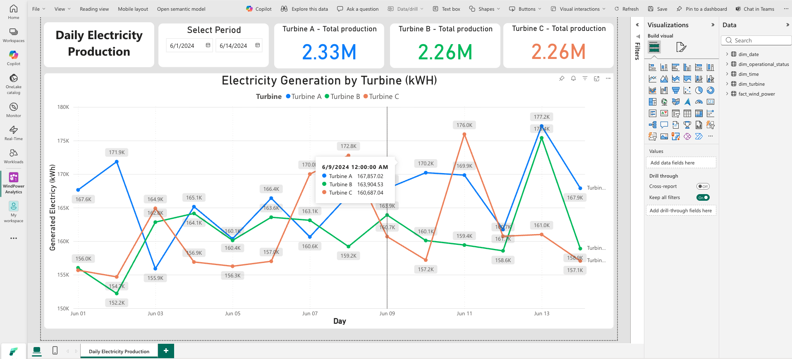
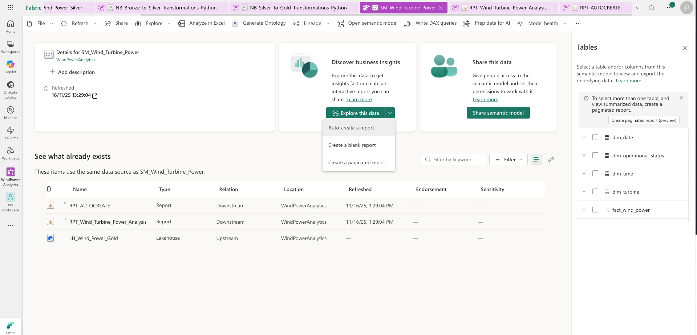
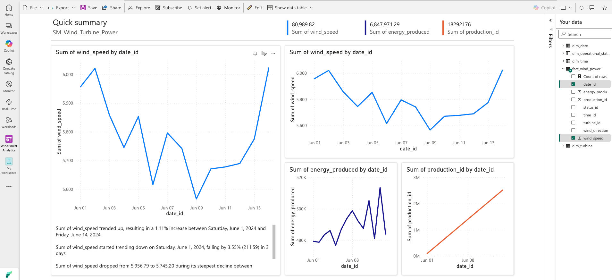

# Étape 7 : Création des rapports Power BI

**Durée estimée :** 60-75 minutes  
**Difficulté :** ⭐⭐ Moyen

---

## 🎯 Objectifs

- ✅ Créer un rapport auto-généré
- ✅ Créer un rapport personnalisé
- ✅ Ajouter des visuels interactifs
- ✅ Configurer les filtres et slicers
- ✅ Tester l'interactivité

---

## 📋 Prérequis

- ✅ Semantic Model créé et publié

---

## 🤖 Tâche 1 : Rapport auto-généré

1. **Semantic Model** → "Auto-create a report"
2. **Explorer** le rapport généré
3. **Sauvegarder** : `RPT_AUTOCREATE`

*Figure : Dialogue 'Save this exploration' dans Power BI*

---

## 🎨 Tâche 2 : Rapport personnalisé

### Créer le rapport

1. **"+ New item" → "Report"**
2. **Sélectionner** : `SM_Wind_Turbine_Power`
3. **Nom** : `RPT_Wind_Turbine_Power_Analysis`

### Page 1 : Vue d'ensemble

#### Titre
- **Text Box** : "Daily Electricity Production"
- Police : Segoe UI, 24pt, Bold

#### KPIs (3 cartes)

**Turbine A**
- Visuel : Card
- Valeur : Total Energy Produced
- Filtre : Turbine = "Turbine A"
- Couleur : Bleu (#0078D4)

**Turbine B**
- Visuel : Card
- Valeur : Total Energy Produced
- Filtre : Turbine = "Turbine B"
- Couleur : Vert (#107C10)

**Turbine C**
- Visuel : Card
- Valeur : Total Energy Produced
- Filtre : Turbine = "Turbine C"
- Couleur : Orange (#D83B01)

#### Slicer de dates

- Visuel : Slicer
- Champ : Date
- Type : Between
- Position : En haut

#### Graphique en lignes

- Visuel : Line chart
- Axe X : Day
- Axe Y : Total Energy Produced
- Légende : Turbine
- Titre : "Electricity Generation by Turbine (kWH)"

*Figure : Rapport complet avec 3 KPIs (Turbine A/B/C) + graphique - MODÈLE À REPRODUIRE*

*Figure : Graphique en lignes - Electricity Generation by Turbine*

---

## 🎨 Tâche 3 : Formater le rapport

1. **Appliquer un thème** : View → Themes → "Executive"
2. **Aligner les visuels** : Utiliser la grille
3. **Couleurs cohérentes** : Même couleur pour chaque turbine

---

## 🔄 Tâche 4 : Tester l'interactivité

1. **Mode lecture** (Reading view)
2. **Tester les slicers**
3. **Cliquer** sur un point du graphique
4. **Vérifier** le cross-filtering

*Figure : Rapport avec slicer de période 'Select Period'*

*Figure : Rapport avec tooltip actif montrant les détails d'un point*

---

## 📸 Captures d'écran

*Figure : Rapport avec titre 'Daily Electricity Production'*

*Figure : Version finale propre et professionnelle du rapport*

---

## ✅ Vérification

- [ ] Rapport auto-généré créé
- [ ] Rapport personnalisé créé
- [ ] 3 KPIs fonctionnels
- [ ] Graphique en lignes interactif
- [ ] Slicers configurés
- [ ] Thème appliqué

---

*Étape 7 complétée ✅ | Temps : ~75 min | Total : ~510 min (~8h30)*
