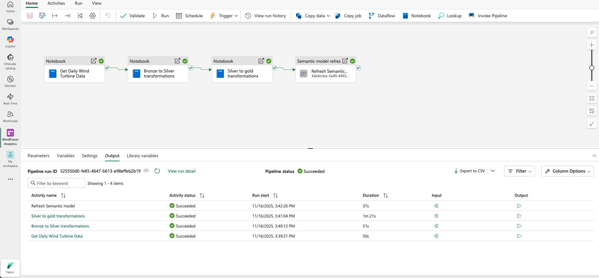

# Étape 5 : Orchestration avec Data Pipeline

**Durée estimée :** 45-60 minutes  
**Difficulté :** ⭐⭐ Moyen

---

## 🎯 Objectifs

- ✅ Créer une Data Pipeline
- ✅ Orchestrer les 3 notebooks
- ✅ Définir l'ordre d'exécution
- ✅ Tester la pipeline complète
- ✅ Planifier l'exécution automatique (optionnel)

---

## 📋 Prérequis

- ✅ Les 3 notebooks créés (Bronze, Silver, Gold)
- ✅ Données dans les 3 Lakehouses


*Figure : la pipeline de données attendu*

---

## 💻 Tâche 1 : Créer la Pipeline

1. **Workspace** → "+ New item" → "Data pipeline"
2. **Nom** : `PL_Orchestration`
3. **Créer**

---

## 🔗 Tâche 2 : Ajouter les activités

### Activité 1 : Ingestion Bronze

1. **Glisser-déposer** "Notebook" depuis le panneau
2. **Nom** : `Get Daily Wind Turbine Data`
3. **Settings** :
   - Notebook : `NB_Get_Daily_Data_Python`
   - Lakehouse : `LH_Wind_Power_Bronze`

### Activité 2 : Transformation Silver

1. **Nouvelle activité** "Notebook"
2. **Nom** : `Bronze to Silver transformations`
3. **Settings** :
   - Notebook : `NB_Bronze_To_Silver_Transformations_Python`

### Activité 3 : Transformation Gold

1. **Nouvelle activité** "Notebook"
2. **Nom** : `Silver to Gold transformations`
3. **Settings** :
   - Notebook : `NB_Silver_To_Gold_Transformations_Python`

---

## ⚙️ Tâche 3 : Définir les dépendances

1. **Cliquez** sur l'activité 1
2. **Point vert "On success"** → glisser vers activité 2
3. **Activité 2** → "On success" → activité 3

**Résultat** :
```
[Get Daily Data] → [Bronze→Silver] → [Silver→Gold]
```

---

## ▶️ Tâche 4 : Tester

1. **Cliquez sur "Run"**
2. **Suivez l'exécution** en temps réel
3. **Vérifiez** que les 3 activités réussissent (✓ vert)

**Temps d'exécution attendu** : 2-4 minutes

---

## 📅 Tâche 5 : Planifier (Optionnel)

1. **Cliquez sur "Schedule"**
2. **New trigger**
3. **Paramètres** :
   - Type : Recurring
   - Fréquence : Daily
   - Heure : 06:00 AM
4. **Activer**

---

## 📸 Captures d'écran

- `05_pipeline_overview.png` - Vue complète de la pipeline
- `05_pipeline_execution_success.png` - Exécution réussie

---

## ✅ Vérification

- [ ] Pipeline créée avec 3 activités
- [ ] Dépendances configurées
- [ ] Exécution manuelle réussie
- [ ] (Optionnel) Planification configurée

---

## 🎯 Prochaine étape

➡️ **[Étape 6 : Semantic Model](07_Etape_6_Semantic_Model.md)**

*Étape 5 complétée ✅ | Temps : ~60 min | Total : ~360 min (~6h)*
