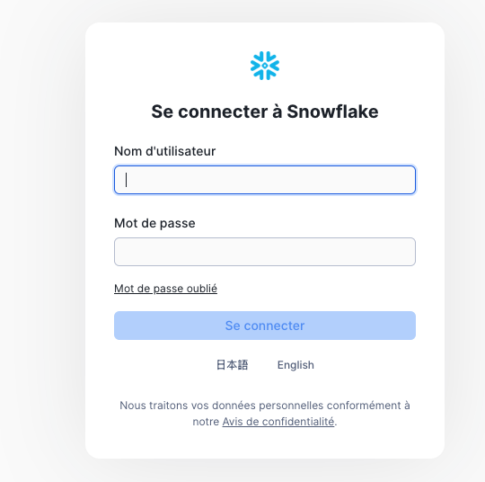

# 2. Connexion à Snowflake

[← Retour au sommaire](README.md) | [← Précédent](01-creation-compte.md) | [Suivant →](03-creation-role.md)

## Vue d'ensemble
Après avoir créé votre compte, cette section explique comment se connecter et naviguer dans l'interface Snowflake.

---

## Étape 1 : Accès à l'interface web
1. Ouvrez votre navigateur et connectez-vous à : `https://[votre-compte].snowflakecomputing.com`
2. Utilisez vos identifiants fournis par votre administrateur


*Page de connexion Snowflake avec les champs username/password*

## Étape 2 : Vue d'ensemble de l'interface
Une fois connecté, vous verrez le tableau de bord principal avec :
- **Worksheets** : Pour exécuter des requêtes SQL
- **Data** : Exploration des bases de données et tables
- **Warehouses** : Gestion des ressources de calcul
- **Account** : Administration du compte


*Interface principale de Snowflake avec les différents onglets*

## Navigation dans l'interface

### Barre de navigation principale
1. **Home** : Tableau de bord avec métriques clés
2. **Worksheets** : Éditeur SQL intégré
3. **Data** : Explorateur de données
4. **Compute** : Gestion des warehouses
5. **Account** : Paramètres et administration

### Raccourcis utiles
- `Ctrl/Cmd + Enter` : Exécuter la requête sélectionnée
- `Ctrl/Cmd + /` : Commenter/Décommenter
- `F5` : Rafraîchir les résultats

## Personnalisation de l'interface

### Thème
1. Cliquez sur votre profil (en haut à droite)
2. Sélectionnez **Preferences**
3. Choisissez entre thème clair ou sombre

### Langue
L'interface est disponible en plusieurs langues :
- Anglais (par défaut)
- Français
- Allemand
- Japonais

## Première vérification

Exécutez cette requête dans un nouveau worksheet pour vérifier votre connexion :

```sql
-- Vérifier les informations de connexion
SELECT 
    CURRENT_USER() AS utilisateur,
    CURRENT_ROLE() AS role_actuel,
    CURRENT_WAREHOUSE() AS warehouse,
    CURRENT_DATABASE() AS base_donnees,
    CURRENT_TIMESTAMP() AS heure_connexion;
```

## 📝 Notes importantes

- **Session timeout** : 4 heures par défaut
- **Multi-onglets** : Possibilité d'ouvrir plusieurs worksheets
- **Historique** : Les 90 derniers jours de requêtes sont conservés

## ✅ Points de vérification
- [ ] Connexion réussie à l'interface
- [ ] Navigation comprise
- [ ] Premier worksheet créé
- [ ] Requête de test exécutée

---

[Suivant : Création d'un rôle personnalisé →](03-creation-role.md)