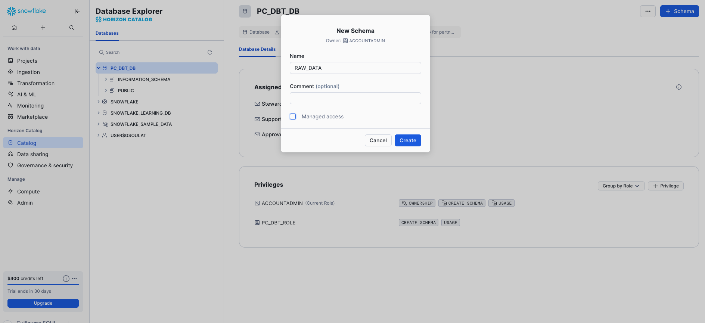

# 5. Création d'une base de données et d'un schéma

[← Retour au sommaire](README.md) | [← Précédent](04-creation-warehouse.md) | [Suivant →](06-creation-tables.md)

## Vue d'ensemble
Nous allons créer une base de données `SALES_DB` avec un schéma `RAW_DATA` pour organiser nos données de ventes.

---

## Étape 1 : Accéder aux bases de données
1. Cliquez sur **Data** dans le menu principal
2. Sélectionnez **Databases** dans le sous-menu


*Navigation vers les bases de données*

## Étape 2 : Créer une base de données
1. Cliquez sur **+ Create Database**
2. Remplissez les informations :
   - **Name** : `SALES_DB`
   - **Comment** : `Base de données pour les données de ventes`
3. Cliquez sur **Create Database**


## Étape 3 : Créer un schéma
1. Cliquez sur la base de données `SALES_DB` nouvellement créée
2. Cliquez sur **+ Create Schema**
3. Configurez le schéma :
   - **Name** : `RAW_DATA`
   - **Comment** : `Schéma pour les données brutes importées`
4. Cliquez sur **Create Schema**


*Création du schéma dans la base de données*

## Architecture de données recommandée

### Organisation par couches
```
SALES_DB/
├── RAW_DATA/         # Données brutes importées
├── STAGING/          # Données en cours de transformation
└── MARTS/            # Données finales pour analyse
```

### Conventions de nommage
- **Bases de données** : MAJUSCULES avec underscore
- **Schémas** : MAJUSCULES avec underscore
- **Tables** : MAJUSCULES avec underscore
- **Colonnes** : MAJUSCULES avec underscore

## Paramètres avancés

### Time Travel
- Permet de récupérer des données supprimées/modifiées
- Par défaut : 1 jour (Standard Edition)
- Jusqu'à 90 jours (Enterprise Edition+)

### Data Retention
Configuration de la période de rétention :
```sql
ALTER DATABASE SALES_DB
SET DATA_RETENTION_TIME_IN_DAYS = 7;
```

## Commandes SQL équivalentes
```sql
-- Créer la base de données
CREATE DATABASE IF NOT EXISTS SALES_DB
    DATA_RETENTION_TIME_IN_DAYS = 7
    COMMENT = 'Base de données pour les ventes';

-- Créer le schéma
USE DATABASE SALES_DB;

CREATE SCHEMA IF NOT EXISTS RAW_DATA
    DATA_RETENTION_TIME_IN_DAYS = 7
    COMMENT = 'Schéma pour les données brutes';
```

## Organisation des données

### Schéma RAW_DATA
Contiendra les tables :
- CUSTOMERS : Clients
- PRODUCTS : Produits
- ORDERS : Commandes
- ORDER_ITEMS : Détails commandes

### Schémas additionnels suggérés
- **STAGING** : Transformations intermédiaires
- **MARTS** : Tables analytiques finales
- **ARCHIVE** : Données historiques

## 📝 Bonnes pratiques

1. **Séparer les environnements** : DEV, TEST, PROD
2. **Documenter** : Toujours ajouter des commentaires
3. **Sécurité** : Limiter l'accès par rôles
4. **Backup** : Utiliser Time Travel et clones

## ✅ Points de vérification
- [ ] Base de données SALES_DB créée
- [ ] Schéma RAW_DATA créé
- [ ] Commentaires ajoutés
- [ ] Navigation possible dans Data Explorer

---

[Suivant : Création des tables →](06-creation-tables.md)